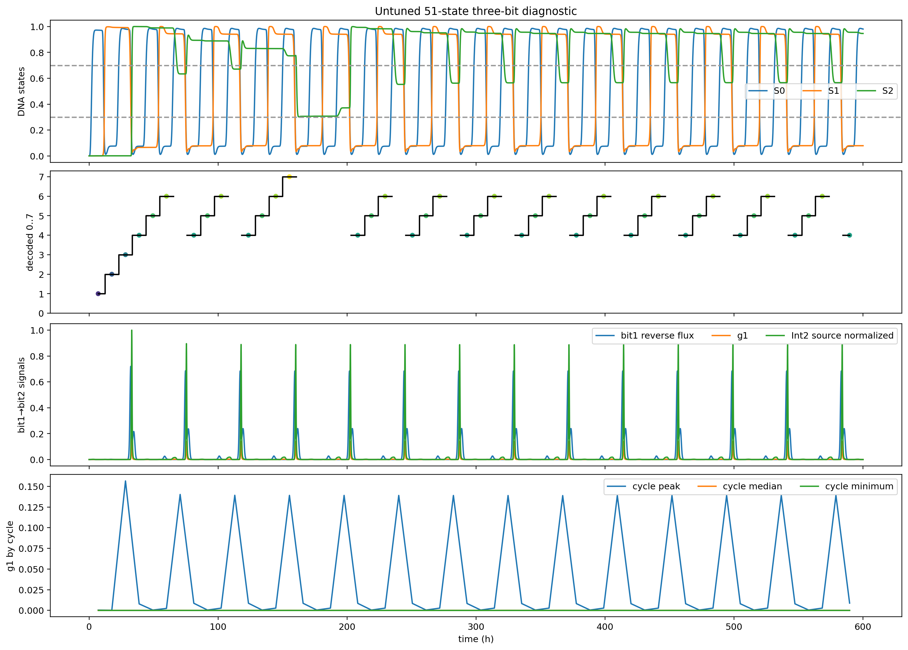

# 51状态三级模型：骨架与首轮未调参诊断

## 状态契约

```text
0–33   冻结的TwoBit34Model精确前缀
34–44  bit2原始11状态
45–46  A1/F1成熟蛋白
47–50  M_A1/A1_u/M_F1/F1_u
```

总计51个连续ODE状态。bit2输入仍通过其原有 `M_I2/I2_u/I2` 链；没有E0/E1，也没有无状态U。

bit2时钟AND门采用曾墨涵代码确认的 `H(Int0;0.4,3)`。A1保留负自馈，F1由 `H(A1;1.2,4)` 驱动。

## 冻结34状态无反馈验收

- 数值Jacobian `∂f[0:34]/∂y[34:51]` 在随机状态上为0；
- 300 h投影RHS最大误差为0；
- 投影轨迹最大绝对误差 `1.03e-8`，处于自适应积分误差量级；
- 前34状态码串完全一致：`1230123012301230123012301230`；
- 51状态投影与冻结34状态均通过两比特因果认证。

因此新增bit2对已认证的两比特子系统严格无反馈。

## 600 h首轮结果

首轮没有调节A1/F1新增参数，暂时沿用carry0的mRNA半衰期2 min、成熟半衰期32.5 min。

- 56个读窗，约7个模8周期；
- bit1主要反向重组事件：14；
- g1 carry窗口：14；
- bit2阈值穿越：仅3；
- 完整三级认证：失败。

门对比度本身通过：

```text
on-cycle g1峰值中位数 = 0.1390
off-cycle g1最大峰值  = 0.00875
off/on峰值比          = 0.0629 < 0.10
```

所以当前失败不是慢性门泄漏，也不是额外carry窗口；14个bit1事件都产生了清楚的g1脉冲。

## 失败机制

bit2第一次正向翻转可以完成：S2从0到约0.99。之后反向翻转不足，最终收敛到一个高态周期轨道：

```text
S2约0.946，脉冲期间最低约0.566
RDF2约6.96
每个carry周期 ∫J_fwd2≈0.45，∫J_rev2≈0.45
净变化≈0
```

也就是说，系统进入了正反重组通量逐周期精确抵消的平衡，而不是因为g1泄漏提前计数。默认A1/F1脉冲剂量能完成第一次正向写入，但不足以持续完成高RDF背景下的反向写入。

## 下一步优化

保持前34状态和曾墨涵表内参数不动，第一轮只扫描A1/F1新增表达参数：

- carry1 mRNA半衰期；
- A1/F1共同成熟时间；
- 若共同成熟无解，再分开A1与F1成熟时间。

目标不是单纯增大g1峰值，而是让每个bit1反向事件对应一次完整bit2翻转，同时维持：

- 14个事件/14个g1窗口；
- off/on门峰值比不高于0.10；
- 600 h模8连续计数；
- 前34状态投影不变。



原始数据见 `diagnostic/trajectory_raw.npz`、`diagnostic/trajectories.csv`、`diagnostic/analysis.json` 和 `diagnostic/summary.json`。
