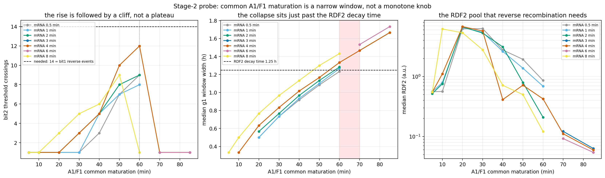

# 第二轮探针（A1/F1 共同成熟 70 / 85 min）：结果与判定

- 对照点 4/60 复现：**True**（穿越数 12，门宽 1.333 h，与第一轮逐值一致）
- 探针 6 个新点全部 **穿越数 = 1**（第一轮最优为 12）

## 与第一轮合并后的响应（bit2 穿越数）

| mRNA/min | 成熟 5→60 段（第一轮） | 70 | 85 |
|---|---|---|---|
| 0.5 | 1 1 1 1 3 7 9 | — | — |
| 1 | 1 1 1 1 5 7 8 | — | — |
| 2 | 1 1 1 3 5 8 9 | — | — |
| 4 | 1 1 1 3 5 10 12 | 1 | 1 |
| 8 | 1 1 3 5 6 9 1 | — | — |

## 预登记判据的触发情况

| 判据 | 结果 |
|---|---|
| crossings keep rising and a point certifies (new points only) | NOT FIRED |
| crossings saturate without exceeding the stage-1 best of 12 | FIRED (worse: new points collapse to 1, control stays at 12) |
| gate contrast degrades further | not fired (contrast improves: 0.0163 -> 0.0111) |

## 结论

Common maturation is exhausted: 60 min is the optimum of the scanned range and 70/85 min collapse (crossings 12 -> 1, reverse/forward flux ratio 1.13 -> 0.003-0.027, free RDF2 median 0.42 -> 0.05-0.12) while the Int2 pulse grows. The next lever must sharpen the carry pulse rather than widen it, i.e. split the A1 and F1 maturation times. Mechanism wording: free RDF2 is lowered by Int2 binding it into C2, by sequestration and by complex loss, not by DNA reverse recombination; the reverse drive depends on the simultaneous product I2*R2, so a falling R2 alone is not proof of substrate shortage.

塌陷的证据（同一批 600 h 运行）：

1. 反向/正向通量比中位数：**1.13 → 0.003–0.027**（这是由同一时刻的`I2·R2` / `C2` 直接算出的通量比，不是靠 R2 单值推断）
2. 自由 RDF2 中位数：**0.42 → 0.05–0.12**。注意机制表述：自由 RDF2 是被 `I2 + RDF2 → C2` 的结合所隔离、以及复合物降解而下降的，**DNA 反向重组本身不消耗 RDF2**；而且反向速率取决于同一时刻的乘积 `I2·R2`（等价地 `C2/K_complex`），不能只看 R2
3. 门宽：**1.33 h → 1.47–1.73 h**，而 RDF2 衰减时间为 **1.25 h**——脉冲一旦明显长于底物寿命，脉冲越强反而越无效

注意 I2 峰值与 Int2 源峰值在塌陷点是**升高**的（2.37→2.5–3.2 / 9.25→9.5–11.2），所以这不是"剂量不足"，而是脉冲与底物存量的时序错配。另外：停滞时刻观测到的 `I2 = 0` 只是脉冲结束后的静止状态，不能用来解释脉冲期间为什么失败——这正是第三轮扫描改用事件对齐指标（门开启时的 R2、I2 峰值时的 R2、`max(I2·R2/1.2)`、`max(C2/K_complex)`）的原因。

## 边界声明

本探针只改变新增的 A1/F1 表达参数；前 34 状态、uM、bit 内部参数、门 `H(Int0;0.4,3)` 与 ZENG 全部冻结；第一轮扫描器与其判据未做任何修改。
