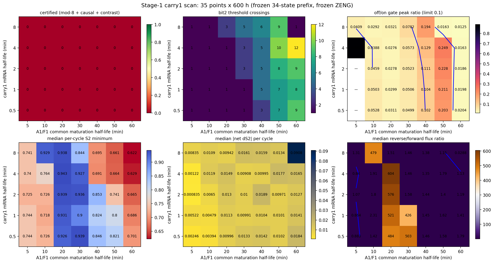
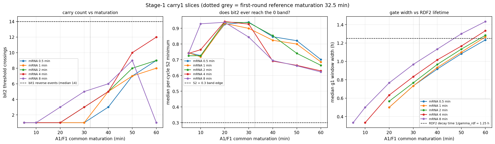

# 51 状态第二级 carry 首轮扫描：结果与分析

- 网格 5(mRNA) × 7(成熟) = **35** 点，每点 600 h；唯一参数组合 35/35
- 积分失败 0；非有限轨迹 0
- 环境一致：True（numpy 2.3.5，pandas 2.3.3）；冻结源文件哈希跨 7 片一致：True

## 1. 完整性与健康度

- 行数/唯一组合/期望：35/35/35
- 求解失败：0；非有限：0
- 数值列非有限计数：{'gate_delay_median_h': 7, 'gate_dose_median': 7, 'gate_duration_median_h': 7, 'gate_peak_median': 7, 'off_median_to_on_peak': 3, 'off_on_peak_ratio': 3, 'rdf2_tau_over_gate_width': 7}

## 2. 完整模 8 认证

- **认证点：0/35**；稳态通过 0/35；门对比度通过 22/35

## 3. 每个参数方向上的 carry 事件对照

### carry1 mRNA 半衰期 0.5 min

| A1/F1 成熟/min | bit1 反向事件 | g1 窗口 | bit2 穿越 | 门宽/h | off/on | S2 周期间最低(中位) | |ΔS2|(中位) |
|---:|---:|---:|---:|---:|---:|---:|---:|
| 5 | 14 | 0 | 1 | nan | nan | 0.744 | 0.0025 |
| 10 | 14 | 0 | 1 | nan | 0.053 | 0.726 | 0.0039 |
| 20 | 14 | 14 | 1 | 0.50 | 0.031 | 0.926 | 0.0100 |
| 30 | 14 | 14 | 1 | 0.73 | 0.050 | 0.939 | 0.0133 |
| 40 | 14 | 14 | 3 | 0.92 | 0.102 | 0.846 | 0.0142 |
| 50 | 14 | 14 | 7 | 1.08 | 0.203 | 0.821 | 0.0102 |
| 60 | 14 | 14 | 9 | 1.23 | 0.020 | 0.701 | 0.0184 |

### carry1 mRNA 半衰期 1 min

| A1/F1 成熟/min | bit1 反向事件 | g1 窗口 | bit2 穿越 | 门宽/h | off/on | S2 周期间最低(中位) | |ΔS2|(中位) |
|---:|---:|---:|---:|---:|---:|---:|---:|
| 5 | 14 | 0 | 1 | nan | nan | 0.744 | 0.0052 |
| 10 | 14 | 0 | 1 | nan | 0.050 | 0.718 | 0.0048 |
| 20 | 14 | 14 | 1 | 0.50 | 0.030 | 0.931 | 0.0113 |
| 30 | 14 | 14 | 1 | 0.73 | 0.051 | 0.900 | 0.0099 |
| 40 | 14 | 14 | 5 | 0.93 | 0.104 | 0.824 | 0.0104 |
| 50 | 14 | 14 | 7 | 1.10 | 0.211 | 0.800 | 0.0101 |
| 60 | 14 | 14 | 8 | 1.27 | 0.020 | 0.686 | 0.0141 |

### carry1 mRNA 半衰期 2 min

| A1/F1 成熟/min | bit1 反向事件 | g1 窗口 | bit2 穿越 | 门宽/h | off/on | S2 周期间最低(中位) | |ΔS2|(中位) |
|---:|---:|---:|---:|---:|---:|---:|---:|
| 5 | 14 | 0 | 1 | nan | nan | 0.725 | 0.0008 |
| 10 | 14 | 0 | 1 | nan | 0.046 | 0.726 | 0.0065 |
| 20 | 14 | 14 | 1 | 0.57 | 0.028 | 0.939 | 0.0130 |
| 30 | 14 | 14 | 3 | 0.77 | 0.052 | 0.936 | 0.0100 |
| 40 | 14 | 14 | 5 | 0.97 | 0.111 | 0.853 | 0.0189 |
| 50 | 14 | 14 | 8 | 1.13 | 0.228 | 0.741 | 0.0097 |
| 60 | 14 | 14 | 9 | 1.28 | 0.019 | 0.665 | 0.0127 |

### carry1 mRNA 半衰期 4 min

| A1/F1 成熟/min | bit1 反向事件 | g1 窗口 | bit2 穿越 | 门宽/h | off/on | S2 周期间最低(中位) | |ΔS2|(中位) |
|---:|---:|---:|---:|---:|---:|---:|---:|
| 5 | 14 | 0 | 1 | nan | 0.889 | 0.740 | 0.0012 |
| 10 | 14 | 11 | 1 | 0.33 | 0.039 | 0.764 | 0.0119 |
| 20 | 14 | 14 | 1 | 0.63 | 0.028 | 0.943 | 0.0149 |
| 30 | 14 | 14 | 3 | 0.83 | 0.057 | 0.927 | 0.0091 |
| 40 | 14 | 14 | 5 | 1.02 | 0.129 | 0.691 | 0.0100 |
| 50 | 14 | 14 | 10 | 1.17 | 0.249 | 0.664 | 0.0177 |
| 60 | 14 | 14 | 12 | 1.33 | 0.016 | 0.629 | 0.0165 |

### carry1 mRNA 半衰期 8 min

| A1/F1 成熟/min | bit1 反向事件 | g1 窗口 | bit2 穿越 | 门宽/h | off/on | S2 周期间最低(中位) | |ΔS2|(中位) |
|---:|---:|---:|---:|---:|---:|---:|---:|
| 5 | 14 | 1 | 1 | 0.33 | 0.041 | 0.741 | 0.0083 |
| 10 | 14 | 14 | 1 | 0.50 | 0.029 | 0.929 | 0.0109 |
| 20 | 14 | 14 | 3 | 0.77 | 0.032 | 0.938 | 0.0094 |
| 30 | 14 | 14 | 5 | 0.97 | 0.078 | 0.844 | 0.0161 |
| 40 | 14 | 14 | 6 | 1.13 | 0.194 | 0.695 | 0.0159 |
| 50 | 14 | 14 | 9 | 1.30 | 0.016 | 0.661 | 0.0134 |
| 60 | 14 | 14 | 1 | 1.43 | 0.012 | 0.622 | 0.0908 |

## 4. 门对比度

- 阈值 0.1；通过 22/35
- off/on 峰值比中位数：0.0501

## 5. 排名（无认证点时按穿越数误差）

|   carry1_mrna_min |   carry1_maturation_min | certified   | steady_passed   | gate_contrast_passed   |   crossing_error |   bit2_crossings |   bit1_reverse_events |   gate_events |   off_on_peak_ratio |   s2_cycle_min_median |   abs_net_ds2_median |   rev_over_fwd_median |   gate_duration_median_h |   bit2_low_cycles |   bit2_high_cycles |   minimum_commitment | steady_sequence                                  |
|------------------:|------------------------:|:------------|:----------------|:-----------------------|-----------------:|-----------------:|----------------------:|--------------:|--------------------:|----------------------:|---------------------:|----------------------:|-------------------------:|------------------:|-------------------:|---------------------:|:-------------------------------------------------|
|               4   |                      60 | False       | False           | True                   |                2 |               12 |                    14 |            14 |           0.0163266 |              0.629242 |           0.016501   |               1.13445 |                  1.33333 |                 0 |                 26 |                    0 | 567xxxx4567xxxx4567xxxx4567xxxx456x4567xxxx4567x |
|               4   |                      50 | False       | False           | False                  |                4 |               10 |                    14 |            14 |           0.249107  |              0.664366 |           0.0177186  |               1.79423 |                  1.16667 |                 0 |                 26 |                    0 | 567xxxx456x4567xxxx4567xxxx4567xxxx4567xxxx4567x |
|               8   |                      50 | False       | False           | True                   |                5 |                9 |                    14 |            14 |           0.0162991 |              0.661333 |           0.0134404  |               1.14896 |                  1.3     |                 0 |                 24 |                    0 | 567xxxx4567xxxx456x4567xxxx456x4567xxxx456xxxxxx |
|               2   |                      60 | False       | False           | True                   |                5 |                9 |                    14 |            14 |           0.0185933 |              0.66461  |           0.0127253  |               1.18964 |                  1.28333 |                 0 |                 18 |                    0 | 567xxxx4567xxxx4567xxxx4567xxxx456xxxxxxxxxxxxxx |
|               0.5 |                      60 | False       | False           | True                   |                5 |                9 |                    14 |            14 |           0.0204289 |              0.70104  |           0.0184386  |               1.79388 |                  1.23333 |                 0 |                 28 |                    0 | 567xxxx456x4567xxxx456x4567xxxx456x4567xxxx456x4 |
|               1   |                      60 | False       | False           | True                   |                6 |                8 |                    14 |            14 |           0.0197994 |              0.686068 |           0.0140557  |               1.41284 |                  1.26667 |                 0 |                 28 |                    0 | 567xxxx456x4567xxxx4567xxxx456x4567xxxx456x4567x |
|               2   |                      50 | False       | False           | False                  |                6 |                8 |                    14 |            14 |           0.228137  |              0.74057  |           0.00970966 |               1.39614 |                  1.13333 |                 0 |                 30 |                    0 | 567xxxx456x456x4567xxxx456x4567xxxx456x456x4567x |
|               1   |                      50 | False       | False           | False                  |                7 |                7 |                    14 |            14 |           0.210979  |              0.799923 |           0.0101314  |               1.61924 |                  1.1     |                 0 |                 30 |                    0 | 567xxxx456x456x4567xxxx456x456x4567xxxx456x456x4 |
|               0.5 |                      50 | False       | False           | False                  |                7 |                7 |                    14 |            14 |           0.203422  |              0.821163 |           0.0101645  |               1.58033 |                  1.08333 |                 0 |                 30 |                    0 | 567xxxx456x456x4567xxxx456x456x4567xxxx456x456x4 |
|               8   |                      40 | False       | False           | False                  |                8 |                6 |                    14 |            14 |           0.193509  |              0.695205 |           0.0158552  |               1.37943 |                  1.13333 |                 0 |                 25 |                    0 | 567xxxx456x456xxxx7xxxx4567xxxx456x4567xxxx4567x |

## 6. 共同成熟时间是否足够

- 结论：**no certified point; best crossing_error=2 at mRNA=4 mat=60 (median crossing/reverse ratio 0.21)**
- 最优解落在网格边界（maturation），先沿该方向延长网格再判断，不要急着改结构。

## 7. 机理检查（dsh 追加）

- 每周期 |净 ΔS2| 中位数：**0.0104**
- 反向/正向通量比中位数：**1.463**
- g1 窗口宽度中位数：**0.95 h**，RDF2 衰减时间 1/γ_rdf = **1.25 h**，宽度/衰减时间 = **0.76**
- 门宽超过 RDF2 衰减时间的点数：5/35
- 逐周期 S2 最低点中位数：**0.744**（要进入 0 带需 ≤ 0.3）
- 与成熟时间的秩相关：穿越数 0.827，S2周期最低 -0.382
- 穿越数与门峰值/Int2 源峰值的线性相关：0.749 / 0.774

> **预登记假说已撤回。** The a-priori story was that a g1 window longer than the RDF2 decay time (1.25 h) lets the free RDF2 pool fall inside the pulse and re-engage the forward reaction.  The measurement does not support it: the median gate width is 0.95 h (below the RDF2 time constant), only 5/35 points exceed it, and wider gates correlate POSITIVELY with success.  The supported reading is an insufficient reverse DOSE: crossings rise monotonically with maturation up to the grid edge, and both the gate peak and the Int2 source peak grow with it.

## 8. 需要多少成熟时间（线性外推）

| carry1 mRNA/min | 斜率(穿越/分钟) | mat=60 时穿越数 | 外推达 14 次所需成熟时间/min |
|---:|---:|---:|---:|
| 0.5 | 0.1462 | 9 | 104 |
| 1 | 0.1419 | 8 | 105 |
| 2 | 0.1606 | 9 | 93 |
| 4 | 0.2108 | 12 | 75 |
| 8 | 0.0700 | 1 | 178 |

## 9. 异常点

- g1 窗口数不足 14 的点（成熟太快时门来不及在每个 carry 周期打开）：9 个 → [(0.5, 5.0, 0), (0.5, 10.0, 0), (1.0, 5.0, 0), (1.0, 10.0, 0), (2.0, 5.0, 0), (2.0, 10.0, 0), (4.0, 5.0, 0), (4.0, 10.0, 11), (8.0, 5.0, 1)]
- 有 14 个窗口但门对比度不达标的点：9 个 → [(0.5, 40.0, 0.102), (0.5, 50.0, 0.203), (1.0, 40.0, 0.104), (1.0, 50.0, 0.211), (2.0, 40.0, 0.111), (2.0, 50.0, 0.228), (4.0, 40.0, 0.129), (4.0, 50.0, 0.249), (8.0, 40.0, 0.194)]
- mRNA=8 的非单调塌陷：crossings at mRNA=8 fall from 9 at mat=50 to 1 at mat=60（该列的外推因此不可信，只有 mRNA=2–4 的外推可用）
- 门对比度在成熟 40–50 min 处最差、到 60 min 又恢复，说明"延长成熟时间"与"保持门对比度"之间存在非单调的张力，下一轮网格必须在60 min 以外加密，而不是只把上界抬高。

## 图

## 边界声明

本扫描只改变新增的 A1/F1 表达参数；前 34 状态、uM、bit 内部参数、门 `H(Int0;0.4,3)` 与 ZENG 全部冻结。所验证的是该 34 状态底座下 bit2 反向写入动力学的可调性，不构成实验标定。
