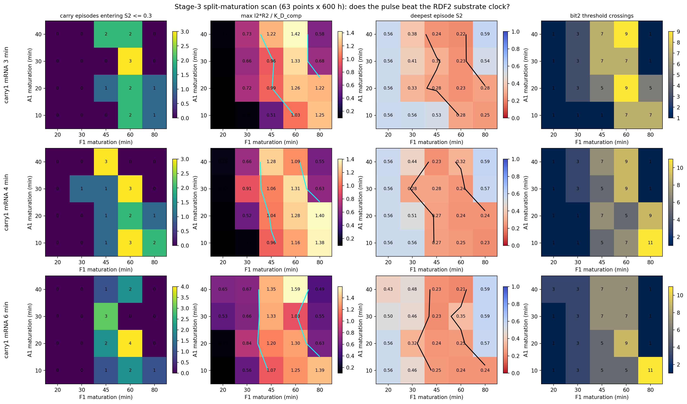
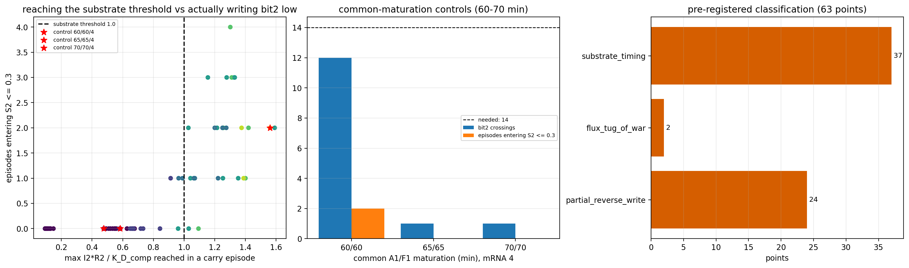

# 第三轮扫描：A1/F1 分开成熟（63 点 × 600 h）

- 完整性 63/63，重复 0，缺失 0
- 积分失败 0；非有限 0
- 冻结源文件跨 9 片一致且未被改动：**True**

## 预登记分类结果

修正判据下（`gate_not_formed` 阈值改为实测的烧入后窗口数 12）：
- `partial_reverse_write`：**24** 点
- `flux_tug_of_war`：**2** 点
- `substrate_timing`：**37** 点

扫描器内预登记判据（阈值误用整段 14）记录的标签：
- `gate_not_formed`：63 点

> 判据修正说明（两条）：
> 1. `gate_not_formed` 原本拿整段 600 h 的 14 个窗口当阈值，但事件只从 100 h 烧入之后收集，真实值对所有点都是 **12**（bit1 冻结）；已修正为"少于其 75%"。
> 2. `gate_leak` 原本用"驻留期 S2 移动 >0.10"，但**正常翻转在每个驻留期都会跨越整个范围**（实测 0.11–0.43），该判据对一切点都成立，已废弃；改用基于结果的分类。
> 两套标签（扫描器内预登记 / 修正后）都已列出。

## 关键问句

- 有 **27** 个点至少一个周期把 S2 写进 ≤0.3（单点最多 4/12 个周期）
- 达到底物阈值 `max(I2·R2)/K_D_comp ≥ 1` 的点：**26/63**
- 底物阈值与"进入低带"的一致率：**92.1%**（本轮最强的机制证据）
- 最深写入：**0.212**（带边 0.30）
- 分开成熟的最好穿越数：**11**；未分开的 60/60 对照：**12**（需要 14）

## 共同成熟对照（mRNA=4）

| A1/F1 | bit2 穿越 | 进入低带周期数 | max(I2·R2)/KD | 最深 S2 | 分类 |
|---:|---:|---:|---:|---:|---|
| 60/60 | 12 | 2 | 1.561 | 0.215 | `partial_reverse_write` |
| 65/65 | 1 | 0 | 0.584 | 0.586 | `substrate_timing` |
| 70/70 | 1 | 0 | 0.477 | 0.592 | `substrate_timing` |

## 判定

PARTIAL: 27/63 points do write bit2 into the S2 <= 0.3 band (best 4 of 12 carry episodes), so the pre-registered "no point enters the low band" trigger does NOT fire. But none of them counts: the best split point reaches 11 crossings against 12 for the un-split 60/60 control, and the deepest write anywhere is only 0.21 against the 0.30 band edge. Expression-time tuning is therefore saturated at partial reverse writes, not exhausted at zero: one bounded local refinement is defensible, but the evidence already points at structure (RDF2/T2 feedback or an independent gate exponent) as the lever that can move 4/12 writes to 12/12.

## 机制表述（已修正）

自由 RDF2 的下降来自 `I2 + RDF2 → C2` 的结合隔离与复合物降解，**DNA 反向重组不消耗 RDF2**；反向速率取决于同一时刻的乘积 `I2·R2`（等价 `C2/K_complex`），因此**不能单用 R2 阈值判断"底物不足"**。本轮所有底物指标都按事件对齐记录：g1 开启时的 R2、I2 峰值时的 R2、`max(I2·R2/1.2)`、`max(C2/K_complex)`、`∫J_rev2`、`∫J_fwd2` 与净变化。

## 图

## 边界声明

本轮只改变新增的 A1/F1 mRNA 半衰期与成熟时间；前 34 状态、uM、bit 内部参数、门 `H(Int0;0.4,3)` 与 ZENG 全部冻结，判据仍为冻结的 `verify_threebit51.analyse_threebit`。
