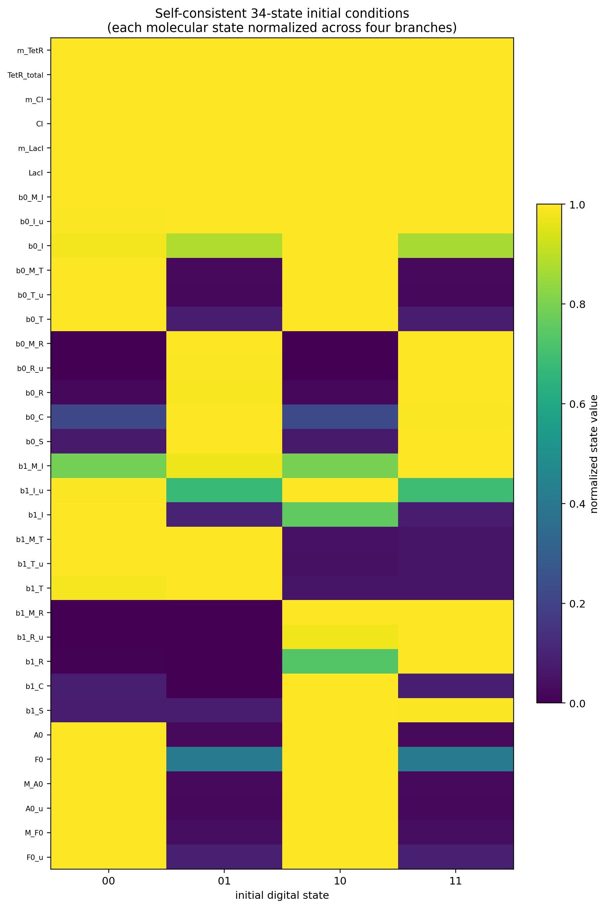

# 正式34状态模型四初态验证

## 方法

四种初态不是通过单独修改 `S0/S1` 构造的。先运行正式模型300 h，从稳定周期-4轨道的有限读窗中分别提取
`00/01/10/11` 时刻的全部34个生化状态，包括RDF、Int–RDF复合物、A0/F0及其mRNA和未成熟蛋白池。

四个状态原本都位于C31通量谷；提取后进一步把前六个振荡器状态及共享C31 mRNA统一为同一个实际轨道相位，
再分别从四种下游状态重新运行300 h。统一前四个通量谷的上游状态最大相对差为6%，统一后严格相同。

## 结果

| 初始值 | 预期读出 | 实际读出 | 完整认证 | bit1 setup/h | bit1 hold/h |
|---|---|---|:---:|---:|---:|
| 00 | `123012301230123012301230123` | `123012301230123012301230123` | 是 | 5.031 | 2.794 |
| 01 | `230123012301230123012301230` | `230123012301230123012301230` | 是 | 5.014 | 2.796 |
| 10 | `301230123012301230123012301` | `301230123012301230123012301` | 是 | 5.016 | 2.804 |
| 11 | `012301230123012301230123012` | `012301230123012301230123012` | 是 | 5.017 | 2.813 |

四组结果均满足：

- 初始DNA状态正确解码；
- 第一个新读窗等于初始值模4加1；
- 之后每个周期严格模4加1；
- 所有读窗最低commitment为1.0；
- 14个主要反向重组事件对应14个carry事件；
- 无额外carry或额外bit1翻转；
- carry及bit1翻转均满足因果顺序；
- 300 h完整认证通过。

## 图

## 解释边界

本实验验证的是：正式ODE存在四个与同一上游时钟相位兼容的、自洽且长期稳定的数字轨道分支，模型能够从任意一个数字值继续计数。

这些初态来自已稳定轨道，因此尚不能证明任意手工配置的 `S0/S1` 和任意分子池都能自动进入对应分支。下一阶段的扰动实验应分别改变
DNA状态、RDF池、A0/F0池和Int1池，测量四个分支的吸引盆与容错范围。

## 文件

- `verify_twobit34_initial_states.py`：构造和验证脚本；
- `four_initial_states.csv`：四组34状态初值；
- `four_initial_states.json`：完整读窗、事件、裕量与构造审计；
- `four_initial_states_summary.csv`：摘要表；
- `four_initial_states.png/.pdf`：四条计数轨迹；
- `initial_state_composition.png/.pdf`：34状态组成热图。
