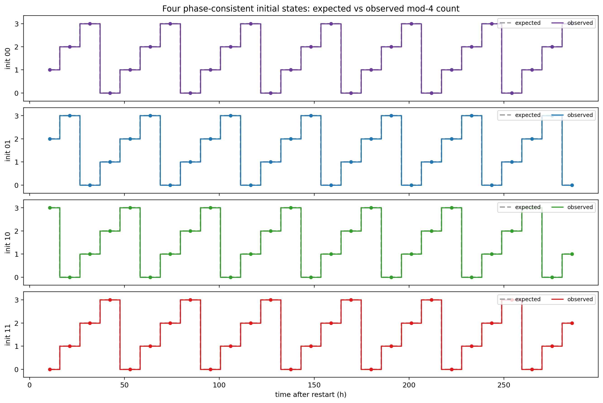
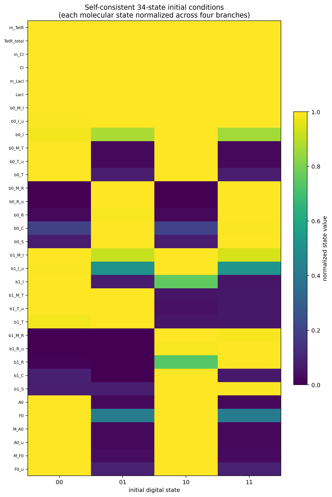

# 选定鲁棒中心的四初态验证

参数中心为 `uM_per_au=5.75`、A0/F0成熟半衰期32.5 min、carry mRNA半衰期2 min。四个完整34状态初态来自稳定周期轨道，并统一到同一上游时钟相位。

| 初态 | 预期读出 | 实际读出 | 结果 |
|---|---|---|:---:|
| 00 | `123012301230123012301230123` | `123012301230123012301230123` | 通过 |
| 01 | `230123012301230123012301230` | `230123012301230123012301230` | 通过 |
| 10 | `301230123012301230123012301` | `301230123012301230123012301` | 通过 |
| 11 | `012301230123012301230123012` | `012301230123012301230123012` | 通过 |

四组均通过冷启动读出、稳态读出、carry一一对应、因果顺序与bit1方向交替。bit1 setup约4.99–5.01 h，hold约2.91–2.94 h。

