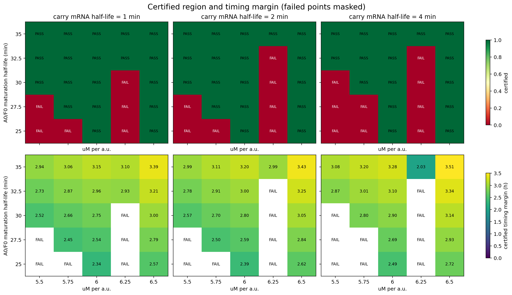

# 75点鲁棒性扫描复核

- 主扫描结论确认：75/75完整，53点完整认证，0积分失败。
- 22个稳态读出失败点中，2点因果三项全通过，20点因果三项全失败。
- 严格内部点定义：三个参数均不在网格边界，且六个轴向邻居全部认证。
- 严格内部点只有 **2** 个，而不是22个。

## 严格内部点

| uM/a.u. | A/F成熟/min | carry mRNA/min | 最小裕量/h | setup/h | hold/h |
|---:|---:|---:|---:|---:|---:|
| 5.75 | 32.5 | 2 | 2.914 | 4.638 | 2.914 |
| 5.75 | 30 | 2 | 2.705 | 4.727 | 2.705 |

## 选择

正式中心选择 **uM=5.75、A0/F0成熟=32.5 min、carry mRNA=2 min**。
它是真正六邻域内部点，冷启动通过，且在严格内部点中时间裕量最大（2.914 h）。

原扫描文件和哈希保持不变；本复核只新增独立解释文件与修正版可视化。
