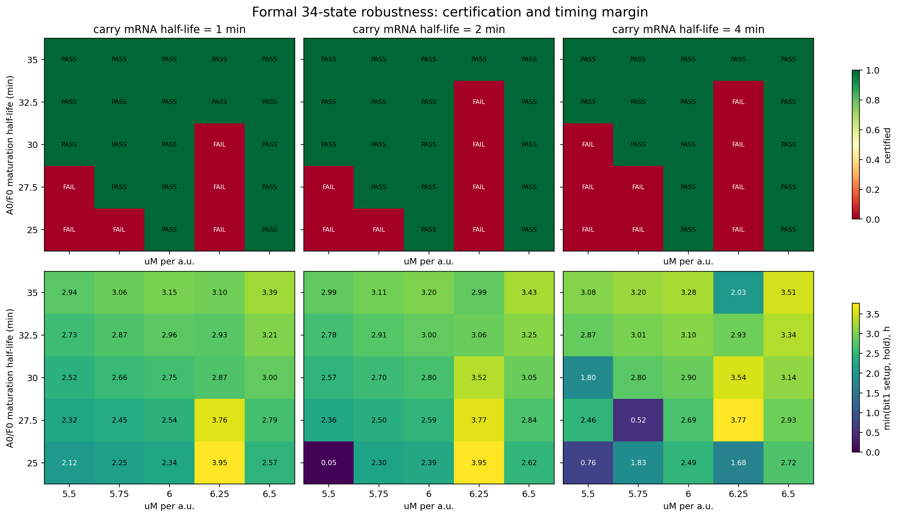

# 正式34状态模型联合鲁棒性扫描

- 完整性：75/75，重复0，缺失0
- 积分失败：0；非有限轨迹：0
- 冷启动通过：34/75；稳态通过：53/75
- 完整因果认证：**53/75 = 70.7%**

## carry mRNA半衰期分层

| mRNA半衰期/min | 通过/总数 | 通过率 |
|---:|---:|---:|
| 1.0 | 19/25 | 76.0% |
| 2.0 | 18/25 | 72.0% |
| 4.0 | 16/25 | 64.0% |

## 最佳点（按最小setup/hold裕量排序）

| uM/a.u. | A/F成熟/min | carry mRNA/min | 最小裕量/h | setup/h | hold/h |
|---:|---:|---:|---:|---:|---:|
| 6.5 | 35 | 4 | 3.509 | 4.561 | 3.509 |
| 6.5 | 35 | 2 | 3.431 | 4.613 | 3.431 |
| 6.5 | 35 | 1 | 3.391 | 4.639 | 3.391 |
| 6.5 | 32.5 | 4 | 3.339 | 4.655 | 3.339 |
| 6 | 35 | 4 | 3.282 | 4.121 | 3.282 |
| 6.5 | 32.5 | 2 | 3.251 | 4.709 | 3.251 |
| 6.5 | 32.5 | 1 | 3.207 | 4.735 | 3.207 |
| 5.75 | 35 | 4 | 3.200 | 4.488 | 3.200 |
| 6 | 35 | 2 | 3.196 | 4.164 | 3.196 |
| 6 | 35 | 1 | 3.153 | 4.182 | 3.153 |

判据与正式模型保持不变；本扫描只改变三个新增、未标定的接口参数，不修改ZENG。
