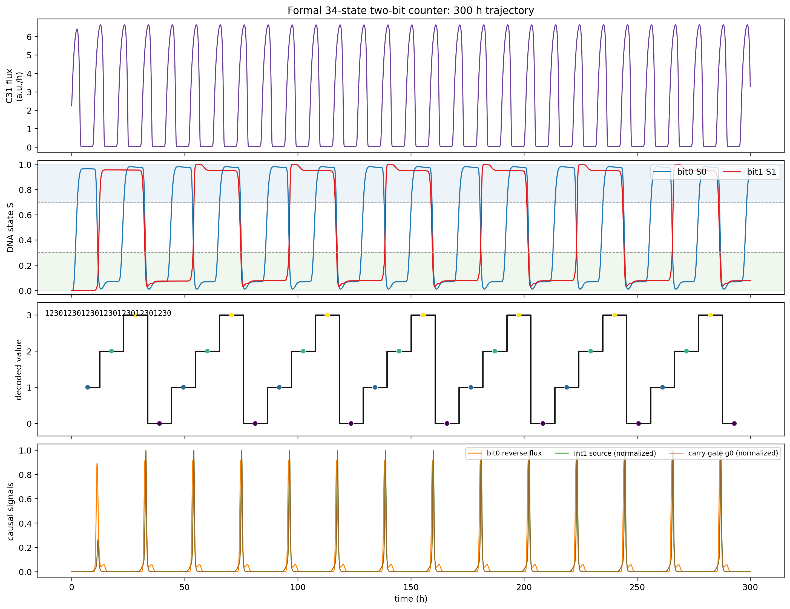
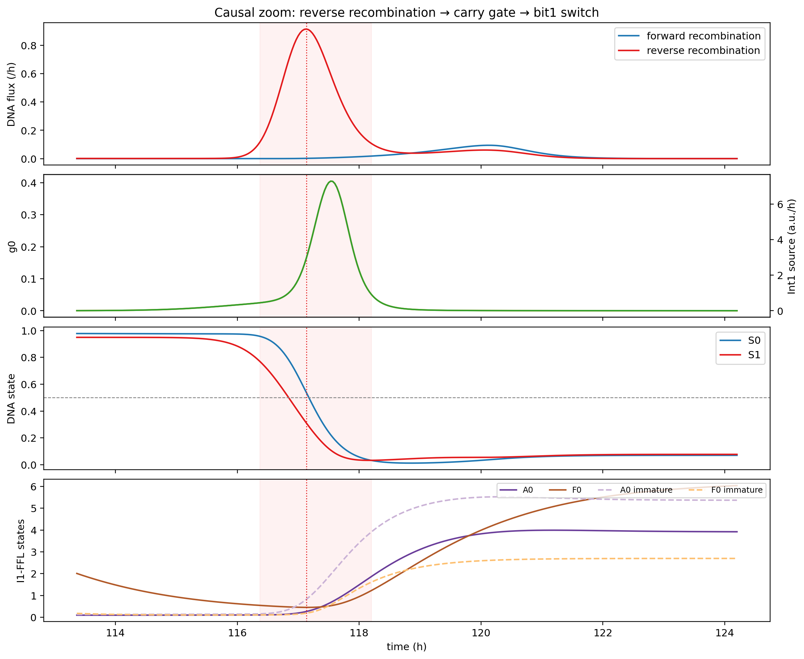
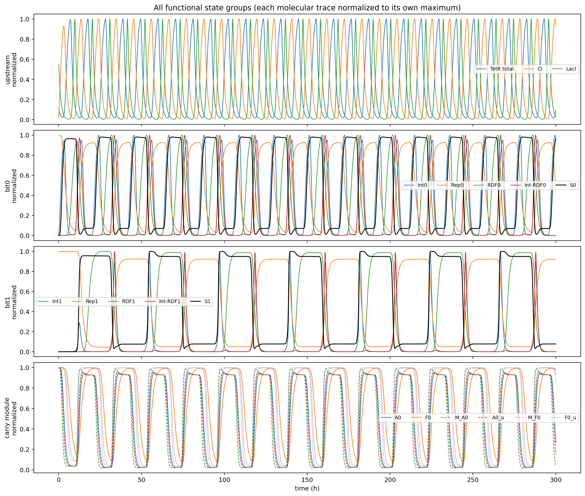
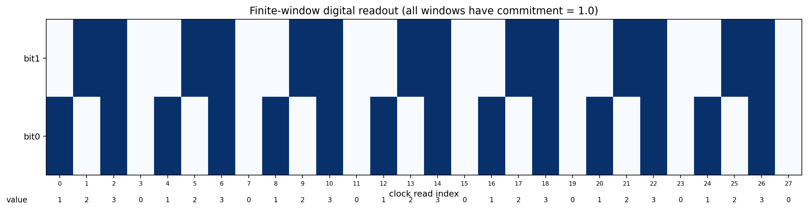
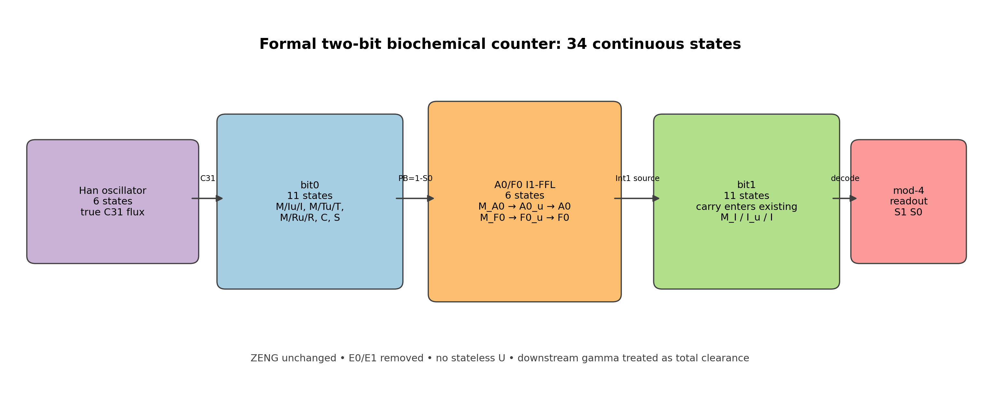

# 正式34状态两比特模型

## 状态组成

| 模块 | 状态数 | 状态 |
|---|---:|---|
| 韩亚轩上游振荡器 | 6 | `m_TetR, TetR_total, m_CI, CI, m_LacI, LacI` |
| bit0 | 11 | `M_I, I_u, I, M_T, T_u, T, M_R, R_u, R, C, S` |
| bit1 | 11 | 同一套11状态 |
| A0/F0成熟调控蛋白 | 2 | `A0, F0` |
| A0/F0表达层 | 4 | `M_A0, A0_u, M_F0, F0_u` |
| 合计 | **34** | 连续ODE状态 |

模型中没有 `E0/E1`，没有无状态的 `U` 整合酶；carry通过bit1原有的 `M_I/I_u/I` 链进入。

## 锁定参数

```text
uM_per_au = 6
bit mRNA half-life = 2 min
bit maturation half-life = 20 min
kon = 0.1 /(a.u. h)
koff = 1 /h
complex decay = 1 /h
add_growth = False

A0/F0 mRNA half-life = 2 min
A0/F0 maturation half-life = 30 min
```

曾墨涵表内 `ZENG` 数值未修改。曾墨涵已确认gamma定义为“本征降解+生长稀释”的总清除率，因此 `add_growth=False` 是正确实现，避免再次叠加稀释。尚待确认的是她采用的具体稀释率或倍增时间。

## 等价性

正式模型与验证通过的临时延迟变体在300 h、9001个采样点上：

- 34状态最大绝对误差：**0**；
- 21个抽样时刻RHS最大误差：**0**；
- `S0/S1/J_fwd0/J_rev0/g0/Int1 source`最大误差：**0**；
- 反向重组事件14/14、carry事件14/14，全部事件指标误差：**0**；
- 冷启动码串：`1230123012301230123012301230`；
- 稳态码串：`123012301230123012301230`；
- 正式模型和临时模型均通过完整因果认证。

## 300 h结果

- 28个有限读窗全部有效，最低commitment为1.0；
- 每个bit0主要反向重组事件恰好对应一次carry和一次bit1翻转；
- 无额外carry、无额外bit1翻转；
- bit1翻转位于主要反向重组开始之后；
- bit1最小建立裕量4.43 h，最小保持裕量2.80 h；
- `g0` 峰值0.405，Int1产生速率峰值7.30 a.u./h。

## 报告插图

### 总体计数轨迹



### carry因果链局部放大



### 34状态功能分组



### 有限读窗数字结果



### 模型结构



## 文件

- `model_twobit34.py`：正式模型；
- `test_twobit34.py`：状态契约与快速回归；
- `verify_twobit34_equivalence.py`：逐状态等价测试；
- `run_twobit34.py`：300 h运行、CSV/JSON和图片生成；
- `trajectories.csv`：34状态及物理信号；
- `read_windows.csv`：28个读窗；
- `parameters.json`：参数、状态顺序和gamma解释；
- `summary.json`：正式验收结果；
- `equivalence.json`：完整等价证据。

当前模型是正式两比特候选，不包含bit2。gamma总清除率语义和75点联合鲁棒性已经确认；仍需解决上下游生长条件不一致、完成扰动与边界严格容差复核后，再考虑第三级。
