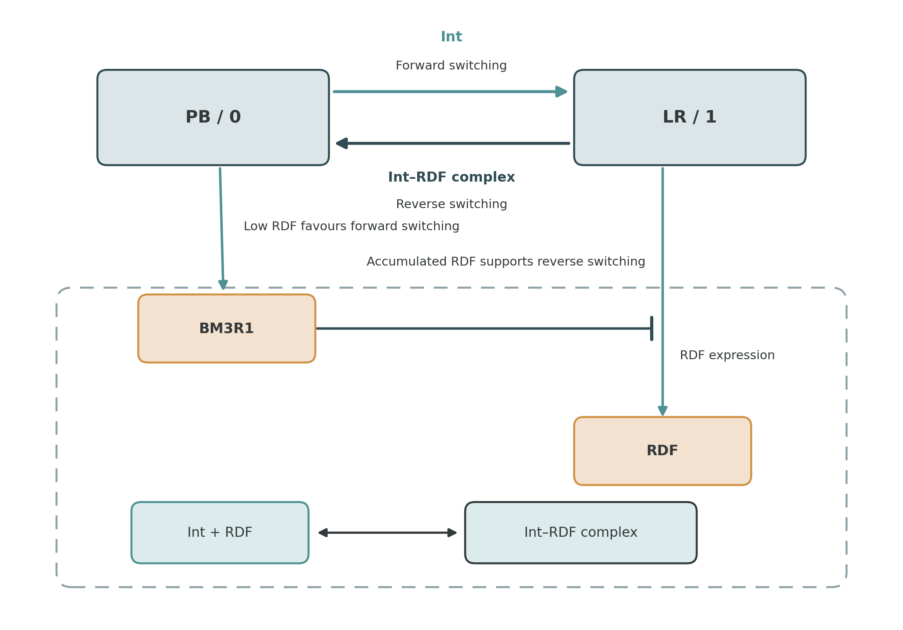
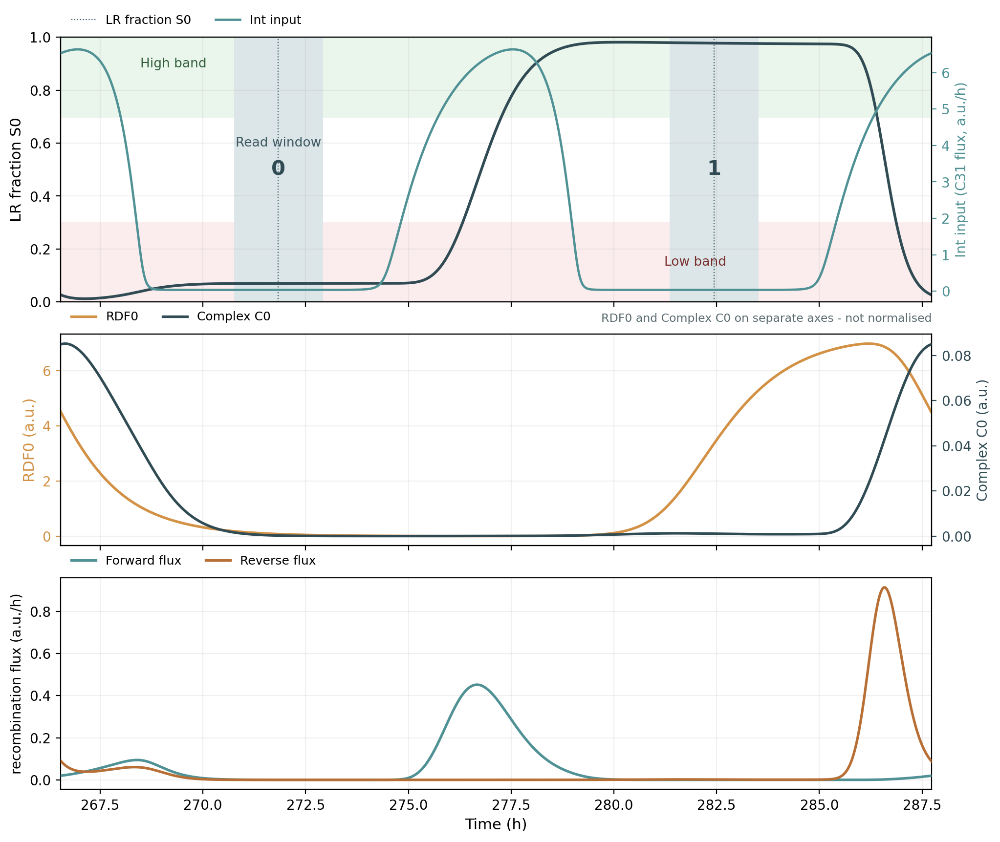
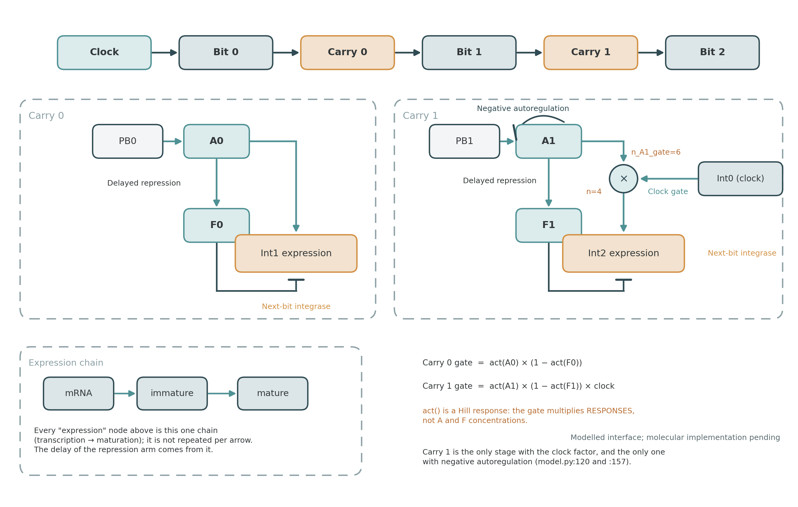
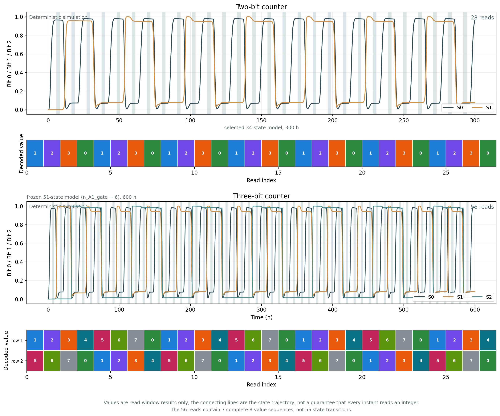
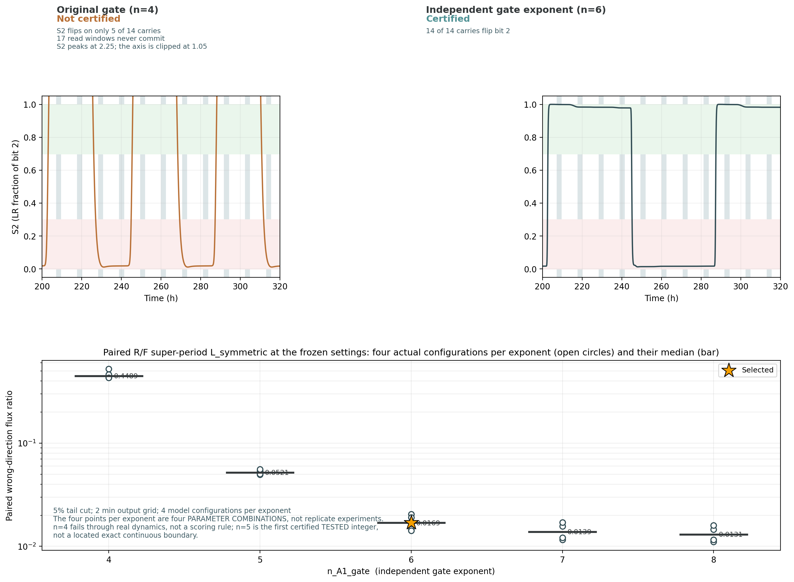
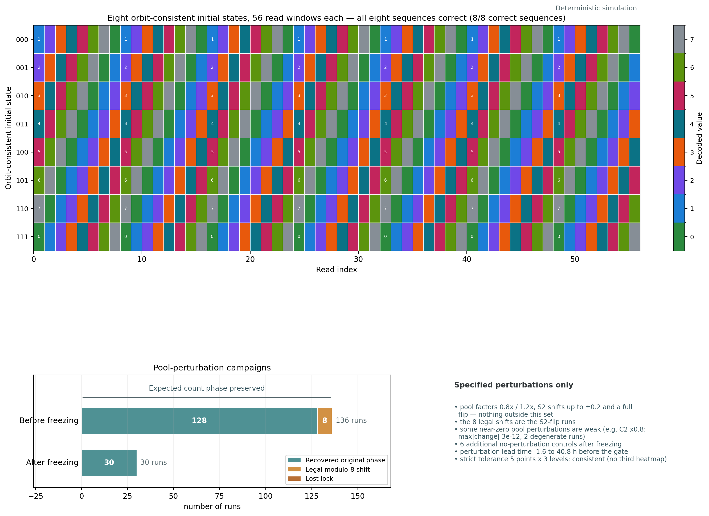

# 第3–4章：6张图讲清楚

每张图只回答一个问题。正文、图号与本目录 `01_Wiki精简稿.md` 对应；数据来源见 `03_取数与交接.md`。
#### 机制图仅供参考
## 交付总览

| 图号 | 要让读者看懂什么 | 类型／负责人 |
|---|---|---|
| 3-1 | 同一个Int脉冲为什么能使DNA来回翻转 | 机制图／美工 |
| 3-2 | 单比特如何翻转，在哪个时间窗读0或1 | 数据图／建模 |
| 4-1 | 上一位如何只给下一位一次有效进位 | 机制图／美工 |
| 4-2 | 两位数到3、三位数到7的实际结果 | 数据图／建模 |
| 4-3 | 为什么选择独立门指数n=6 | 对照数据图／建模 |
| 4-4 | 换初态、受扰动后还能不能计数 | 验证摘要图／建模 |

## 共用风格

- 白底，图内英文；正文解释和图注留在网页上，不塞进图片。
- 沿用Oscillator示例：深蓝 `#304B53` 表结构，橙 `#D29144` 表输入／需关注的变化，青绿 `#4F9194` 表输出；文字深灰。
- 激活用箭头，抑制用T形线端，可逆结合用双向箭头；通过／失败同时写文字，不能只靠颜色。
- 单张最多3个面板，最终显示时字大线清。先做静态图；机制图交SVG＋PNG，数据图交PNG＋PDF。
- 不要求本轮做动画、滑块或复杂交互；图片目录由网页组确认。

## 🟨 Figure 3-1 — Single-bit memory

供参考
**一句话结论：DNA构型与调控分子池共同决定下一次输入的翻转方向。**

左右放PB（0）和LR（1）两种DNA构型，往返箭头分别标 `Int` 和 `Int–RDF complex`。下方只画一组调控关系：

```text
PB → BM3R1 ─┤ RDF expression
LR → RDF expression
Int + RDF ⇌ Int–RDF complex
```

两个状态旁各加一句：PB侧 `Low RDF favours forward switching`；LR侧 `Accumulated RDF supports reverse switching`。

必须画对：复合物是模型中的有效显式状态，不画成已经确认的精确分子结构；不要把“DNA无记忆、全部记忆在RDF”写进图里。

英文标签：`PB / 0`、`LR / 1`、`BM3R1`、`RDF`、`Int`、`Int–RDF complex`、`Forward switching`、`Reverse switching`。

## 📈 Figure 3-2 — Switching and read windows

**一句话结论：翻转过程可以是连续的，但读窗中的电平必须稳定。**

截取选定模型后段两个连续时钟周期，共用时间轴：

- 上：Int输入与S0轨迹，阴影标出0–0.3和0.7–1读带，以及谷值两侧总宽20%的读窗。
- 中：RDF0与复合物C0；不同量级分轴或明确标注归一化。
- 下：实际正反重组通量 `J_fwd0`、`J_rev0`。

必须画对：使用真实轨迹，不能画成理想方波；周期20%是整个读窗宽度；末端数据不足的窗口不拼接补齐。

英文标签：`Time (h)`、`LR fraction S0`、`Read window`、`Low band`、`High band`、`RDF0`、`Complex C0`、`Forward flux`、`Reverse flux`。

## 🟨 Figure 4-1 — Carry architecture

供参考
**一句话结论：激活臂和延迟抑制臂形成进位，第二级再增加时钟约束。**

上方画整体链：`Clock → Bit 0 → Carry 0 → Bit 1 → Carry 1 → Bit 2`。

下方并排画两级carry：

```text
Carry 0: PB0 → A0 → Int1 expression
                 └→ F0 ─┤ Int1 expression

Carry 1: PB1 → A1 → Int2 expression
                 └→ F1 ─┤ Int2 expression
              A1 ─┤ its own production
              Int0 clock gate → AND → Int2 expression
```

用一个小插图统一说明 `mRNA → immature → mature`，不要在每条箭头旁重复画完整表达链。

必须画对：只有第二级带时钟AND门；F抑制的是输出，门相乘的是激活和解除抑制后的响应，不能画成“A浓度×F浓度”；`n_A1_gate=6`只标在A1→Int2门，A1→F1产生的指数仍为4。

英文标签：`Carry 0`、`Carry 1`、`Delayed repression`、`Negative autoregulation`、`Clock gate`、`Next-bit integrase`、`Modelled interface; molecular implementation pending`。

## 📈 Figure 4-2 — From modulo 4 to modulo 8

**一句话结论：同一类生化比特可以扩成两位和三位计数。**

- Panel A：选定34状态模型的300 h结果；S0/S1曲线下配28格读数条带，显示 `1 2 3 0`。
- Panel B：冻结n=6的51状态模型600 h结果；S0/S1/S2曲线下配56格读数条带，显示 `1 2 3 4 5 6 7 0`。

条带可以分行，但不能省略失败／未定义窗口。图中只保留“28 reads”和“56 reads”；drop定义、实际初态和读窗规则写在图注。

必须画对：图中的数字是读窗结果，连线不代表读窗之外每个瞬间都能无误读取整数；56个读数含7段完整8值序列，不应另宣称观察到56次完整状态转移。

英文标签：`Two-bit counter`、`Three-bit counter`、`Bit 0 / Bit 1 / Bit 2`、`Decoded value`、`Read index`、`Deterministic simulation`。

## 📈 Figure 4-3 — A sharper gate enables three-bit counting

**一句话结论：独立提高门指数改善计数，n=6兼顾较低残余活动和适中的设计改动。**

- Panel A：同一表达设置下n=4与n=6的S2轨迹及读窗；标明前者失败、后者通过。只选同一段时间，保留真实过渡和低态。
- Panel B：n=4、5、6、7、8的配对 `L_symmetric`；每个n画4个实际点并标中位数，用星号标选择n=6。

中位数可用：`0.4489 / 0.0521 / 0.0169 / 0.0139 / 0.0131`。图注必须写 `5% tail cut; 2 min output grid; 4 model configurations per exponent`。

必须画对：这4点是4个参数组合，不是实验重复；n=4有真实动力学失败，不能写成仅因评分错误；n=5只是已测试整数中的首个通过值，不是已定位的精确连续分界。

英文标签：`Original gate (n=4)`、`Independent gate exponent (n=6)`、`Not certified`、`Certified`、`Paired wrong-direction flux ratio`、`Selected`。

## 📈 Figure 4-4 — Validation summary

**一句话结论：所选三级轨道可从不同数字初态续跑，并承受规定范围内的扰动。**

- Panel A：8行×56列读数条带，行名000–111，色标0–7；展示不同初态的相位偏移，标 `8/8 correct sequences`。
- Panel B：两组水平堆叠条：冻结前136次＝128恢复＋8合法相移＋0失锁；冻结后30次＝30恢复＋0相移＋0失锁。

图注说明：8次合法相移来自S2翻转；136次中部分近零池扰动偏弱；后冻结另有6条无扰动对照，且部分扰动提前29–41 h施加。严格容差5×3结论一致可作为旁边一句注释，不再加第三张复杂热图。(当然如果认为加上热图效果更好也可以在这里加)

必须画对：不能标“实验成功率100%”或“任意噪声鲁棒”；若八初态用单元格着色，必须带数字色标。

英文标签：`Orbit-consistent initial state`、`Expected count phase preserved`、`Recovered original phase`、`Legal modulo-8 shift`、`Lost lock`、`Specified perturbations only`。

## 排版只保留三件事

1. 每节先用一句话给结论，再放对应主图，最后放简短解释。
2. 参数表、ODE、旧扫描和复现信息放Methods／补充材料。
3. shutdown接口留一段文字即可，本轮不再增加第7张主图；后续联合验证完成后再扩展。
