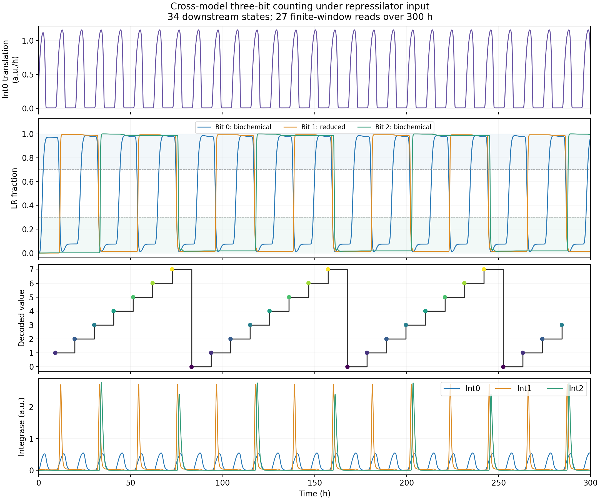
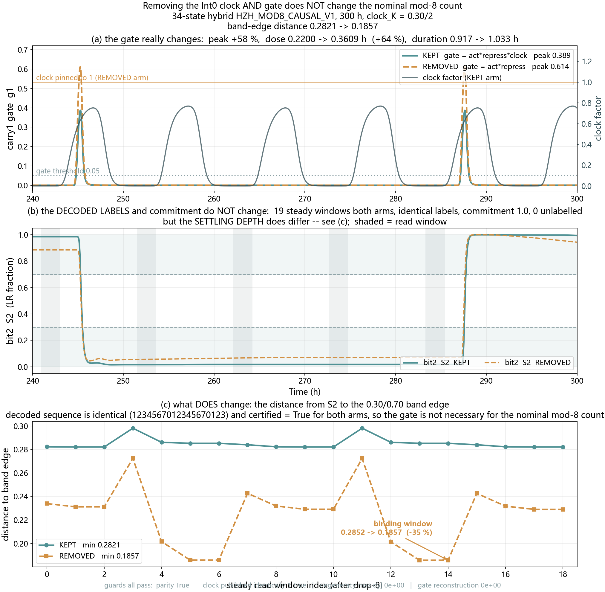

<!-- Publication status: this file supersedes the hybrid-model body in Section 5 of wikiformal.md. The Chinese draft and bilingual comparison are synchronized language versions. Other sections of the older page are outside this replacement. -->

## A Three-Bit Hybrid Cascade: Generating a Single Effective Carry from a Lower-Order State Transition

Multi-bit counting requires both state retention within each bit and a single effective write signal to the next bit when the lower-order bit resets. To examine whether the two model formulations can jointly satisfy these requirements, we coupled bit0 and bit2 from the free-integrase biochemical kinetics model to the first carry network and bit1 from the reduced feed-forward-loop model. The connected modules were integrated as a single system of ordinary differential equations (ODEs).

With the upstream oscillator model developed by Han as the driver, the hybrid system produced 27 consecutive, unambiguous readouts over 300 h. After excluding the first complete modulo-8 counting cycle, the remaining 19 readouts continued to increment by one modulo 8 at each clock cycle, demonstrating continuous three-bit counting under the specified conditions.

### Three State-Holding Bits and Two Carry Interfaces

The principal architecture is **HBY bit0 → ZMH bit1 → HBY bit2**, hereafter referred to as HZH. The bit0 and bit2 modules distinguish mRNA, immature protein, mature free protein, and integrase–recombination directionality factor (Int–RDF) complexes. The middle module retains the feed-forward network and reduced equations from Zeng’s current two-bit implementation, `完整二级级联.py`. Each module preserves its documented parameter provenance.

| Module | Role in the hybrid model | Number of continuous states |
| --- | --- | ---: |
| HBY bit0 | Receives the upstream C31 expression input and stores the least significant DNA state | 11 |
| ZMH A0/F0 and bit1 | Generates the Int1 carry pulse and stores the intermediate DNA state | 2 + 4 |
| HBY A1/F1 and bit2 | Generates the Int2 input and stores the most significant DNA state | 6 + 11 |

The downstream system comprises 34 continuous states. The upstream oscillator is solved separately and supplies a prescribed, unidirectional input to bit0; its states are excluded from this count. Bits 0, 1, and 2 represent the least significant, intermediate, and most significant bits, respectively. The numerical count is decoded from their DNA configurations.

### Interface 1: Converting the Reset of Bit0 into an Int1 Pulse

Bit0 is driven by the C31 transcription and translation fluxes computed from Han’s upstream model. The C31 transcript is represented once and supplies the immature Int0 pool, which subsequently matures into free Int0 and participates in DNA recombination. No additional gain from the square-wave input model is applied to this expression pathway.

When bit0 undergoes the LR-to-PB reset, the increasing PB fraction, $PB_0=1-S_0$, drives A0 production. A0 activates Int1 synthesis through the direct arm and induces the slower F0 inhibitory arm. As F0 accumulates, it suppresses further Int1 synthesis. This incoherent feed-forward structure therefore converts a sustained DNA-state signal into a transient write input.

Using the activation function $H(x;K,n)=x^n/(K^n+x^n)$ and its inhibitory counterpart $G=1-H$, the first-stage gate and Int1 dynamics are:

$$
g_0=H(A_0;1.0,2)\,G(F_0;2.6454,5.4332),
\qquad
\frac{dI_1}{dt}=22.728\,g_0-4.8I_1.
$$

Time is expressed in hours, and $I_1$ denotes the mature integrase in bit1. The production coefficient is 22.728 a.u. h$^{-1}$, and the clearance rate is 4.8 h$^{-1}$. This module retains direct protein-level dynamics without introducing additional mRNA or maturation states. The carry inhibitor F0 is denoted r0/R0 in `完整二级级联.py` and F0_zmh in the hybrid implementation; it is distinct from the RDF pool within each bit.

### Interface 2: Controlling Int2 Expression with the Bit1 State and a Shared Clock

The PB fraction of the ZMH bit1 module drives A1 expression. A1 is negatively autoregulated and activates F1 production. The second-stage gate combines A1 activation, F1 inhibition, and a clock factor derived from mature free Int0 in bit0:

$$
g_1=H(A_1;1.2,6)\,G(F_1;0.4,4)\,H(I_0;0.3,2),
\qquad u_{I2}=38g_1\;\mathrm{a.u./h}.
$$

The gate specifies a target mature-protein production rate, which is mapped to the mRNA synthesis source in bit2. The expression pathway then proceeds from mRNA through immature Int2 to mature free Int2. Free Int2 supports forward recombination, whereas its complex with RDF2 supports reverse recombination, allowing bit2 to alternate between writing and resetting.

The clock factor reads Int0 from the same hybrid circuit. In the reference configuration, the activation exponent of 6 applies only to the Int2 production gate; the exponent governing A1-induced F1 synthesis remains 4. The value 6 represents effective response steepness and does not imply an experimentally implemented promoter with six binding sites.

### Continuous Three-Bit Counting over 300 h

DNA states were decoded within windows centered on the Int0 trough between consecutive peaks. Each window spanned approximately 20% of the corresponding clock period. A bit was assigned 0 if at least 80% of the samples had an LR fraction no greater than 0.30, or 1 if at least 80% had an LR fraction no less than 0.70. Windows that satisfied neither condition were left unlabelled.

*Input, DNA-state trajectories, decoded counts, and integrase waveforms from a single simulation of the HZH system. All 27 read windows were unambiguous, yielding repeated sequences of 1, 2, 3, 4, 5, 6, 7, and 0. The minimum within-window commitment across all three bits was 1.0. These results apply to the specified HZH parameter set and Han upstream input.*

| Assessment | HZH result |
| --- | --- |
| Simulation duration | 300 h |
| steady-state read windows | 27 / 19; modulo-8 increments were retained after excluding the first eight windows |
| boundary-clipped windows | 0 / 0 |
| bit2 | 29 / 14 / 7 |

The least significant bit switched most frequently, with successive higher-order bits switching at approximately half the frequency of the preceding bit. Together, the three DNA states encoded continuous modulo-8 counting, with one effective carry associated with each lower-order reset.

### Verification of Carry Events and Complete Biochemical Initial States

In addition to decoding the numerical sequence, we independently detected reverse-recombination episodes, carry-gate events, and higher-order DNA transitions to evaluate their associations:

| Carry stage | Lower-order reverse-recombination events | Gate events | Higher-order transitions |
| --- | ---: | ---: | ---: |
| bit0 → bit1 | 14 | 14 | 14 |
| bit1 → bit2 | 7 | 7 | 7 |

The first two carry events at each stage were treated separately as startup events. Subsequent events satisfied the predefined one-to-one association and temporal criteria, with alternating higher-order transition directions. The minimum timing margin between a read window and an adjacent DNA transition was approximately 1.18 h; the limiting quantity was the hold margin of bit0.

The decoded sequences and event-association verdicts were unchanged when integration tolerances were tightened and the output sampling interval was reduced from 1 min to 0.5 min. Eight complete 34-state initial conditions were extracted at the troughs of eight consecutive steady-state read windows, spanning one complete modulo-8 cycle and representing counts 1–7 followed by 0. Each was continued for an additional 300 h while preserving its corresponding absolute upstream time. All eight simulations began with the expected successor count and passed the same evaluation criteria, as documented in the [primary eight-digital-state verification record](hby_zmh_hby/certification/eight_phase_results/20260928_144314_590882/summary.json).

These initial conditions are phase-consistent states on a single deterministic trajectory and support retention of the counting phase. They do not quantify performance under arbitrary initial conditions or stochastic fluctuations. The complete criteria and numerical checks are documented in the [hybrid-model verification report](hby_zmh_hby/certification/认证结果说明.md).

### The Clock Gate Modifies the Write Waveform and State-Settling Depth

To assess the contribution of the Int0 clock factor, we set this factor to 1 while retaining the remaining equations. Modulo-8 decoding and the event-association criteria at both stages remained satisfied at the nominal operating point. However, the carry output g1 increased, and the bit2 plateau states moved closer to the read-band boundaries. Thus, the clock gate was not required for nominal digital counting in this test, although it altered the write dynamics.

*Both conditions retained modulo-8 digital labels, but their continuous DNA-state trajectories differed. Bypassing the clock factor reduced the minimum bit2 read-window distance to a band boundary from 0.2821 to 0.1857. This metric describes state-settling depth and does not constitute an experimental measurement of noise tolerance.*

We subsequently rescaled the Int2 synthesis source in the clock-bypassed condition to match its time integral to that of the clock-retained condition over one complete modulo-8 cycle. The minimum band-edge distance increased to 0.2524 but remained below the clock-retained value:

| Condition | Modulo-8 decoding and event criteria | Minimum bit2 read-window band-edge distance |
| --- | --- | ---: |
| Clock retained | Passed | 0.2821 |
| Clock bypassed | Passed | 0.1857 |
| Clock bypassed, Int2 source integral matched | Passed | 0.2524 |

This comparison is consistent with a contribution from total input magnitude, while also indicating that the temporal distribution of the input requires separate consideration. Equal source integrals do not ensure identical mature Int2 waveforms or DNA plateau states. Differences between these conditions cannot be interpreted as independent, additive biochemical causal effects.

### The Operating Region Depends on the Interface and Receiving Module

Parameter scans of the hybrid model showed that increasing the second-stage A1 activation exponent improved bit2 timing margins and extended tolerance to shifts in the A1 activation threshold. Within the tested grid, it did not shift the counting boundary along the concentration-conversion factor (uM_per_au) axis. Failure near the upper boundary of this factor first manifested as inadequate read-band commitment in bit1. Because the downstream gate does not feed back to bit1, changing that gate cannot restore the lower-order state.

The clock threshold must also be evaluated relative to the Int0 waveform supplied by the coupled model. The paired scan comprised 60 runs: 10 K values, two clock exponents, and three receiving-stage configurations, all retaining the same lower two bits. All 20 HZH runs passed both counting and event-association criteria at the 10 tested K values spanning 0.075–0.60 and clock exponents of 2 and 3. The remaining 40 runs evaluated HZZ with A1 autoregulation enabled or disabled. These results establish performance at the sampled points; they do not demonstrate a continuous feasible interval or characterize behavior outside the tested range.

### An Alternative Receiving Stage: The HBY–ZMH–ZMH Cascade

As a supplementary coupling test, we retained the same first 17 states and replaced the receiving stage with the exploratory A1/F1 and bit2 equations from Zeng’s three-bit script, `前馈三级级联.py`. The resulting HZZ system comprises 23 states. Its receiving stage uses a distinct parameter set and originally employs the clock factor $H(I_0;0.4,3)$; these parameters are not a simple unit conversion of the current two-bit implementation.

With A1 negative autoregulation disabled, the receiving-stage equations and parameters retained, and initial conditions consistent with the active equations, direct coupling to HBY Int0 did not produce modulo-8 counting. After the clock threshold was reset to 0.10, a 600 h simulation yielded 48 steady-state modulo-8 readouts. Eight complete 23-state initial conditions representing counts 0–7 were then continued for 300 h each, preserving their corresponding upstream phases. All eight continuations passed the counting and event-association criteria.

This supplementary test demonstrates that an alternative receiving stage can support the cascade following reassessment of the clock–carry interface. It does not establish successful direct transfer of the original exploratory three-bit parameter set, nor does it justify treating the K values of the two receiving stages as identical physical thresholds. The [HZZ long-duration results](hby_zmh_zmh/failure_attribution/results/round3_20261001_135824/round3_summary.json) and [corrected eight-state continuations](hby_zmh_zmh/failure_attribution/results/round5b_20261001_173719/eight_states.json) document these evaluations separately.

### Implications for Implementation and Current Limitations

The hybrid coupling identifies specific requirements for experimental characterization. Lower-order bits must first exhibit well-resolved plateau states. The carry pulse generated after a reset must then complete the higher-order write operation and cease before the next read window. Pulse width, mature integrase dynamics, RDF timing, and forward and reverse recombination fluxes should therefore be assessed over complete cycles rather than inferred from peak amplitudes alone.

The results support deterministic three-bit counting under the specified equations, parameter sets, and input conditions. The concentration-conversion factor and added expression parameters remain experimentally uncalibrated. The growth conditions underlying the 50 min upstream doubling time and some downstream total clearance rates have not yet been reconciled. The candidate orthogonal recombinases and regulatory factors also require individual characterization; the current numerical values should not be treated as experimentally measured parameters for three distinct enzyme systems.

Model Provenance, Complete Parameters, and Reproducibility Records

The [HZH core-equation and notation appendix](混合三级级联_核心方程与符号.md) specifies the bit-dependent forward and reverse recombination laws, the conversion from protein production targets to mRNA sources, and the quasi-steady-state mapping for explicit complexes. The forward Hill exponent is 2 for HBY bit0/bit2 and 4 for ZMH bit1.

The HZH middle module uses the current parameters from `完整二级级联.py`. The two HBY bit modules retain the early baseline parameter table and selected extensions of the independent free-integrase model. Source files and unit conversions are documented in the [complete parameter and provenance record](hby_zmh_hby/主结果_完整参数与来源.md). Module coupling is implemented in [model_hzh.py](hby_zmh_hby/model_hzh.py), and the evaluation criteria are defined in [verify_hzh.py](hby_zmh_hby/certification/verify_hzh.py).

Although the valid HZH records are stored in a directory named eight_phase_results, their initial conditions span eight consecutive steady-state read windows and eight distinct digital values. This construction is distinct from the superseded HZZ experiment that sampled eight subphases within a single clock cycle and restarted the upstream driver. The superseded fig4_eight_phases and fig6_phase_events are not evidence for the present claim.

Readout uses the 0.30/0.70 bands and an 80% occupancy requirement. Event-detection thresholds and their scope are specified in the verification report. These thresholds are analysis conventions rather than biochemical write thresholds. Operating-point data are available in the [60-point clock scan](时钟工作区扫描/results/clock_axis_20261001_180035_369646/summary.json). Figure provenance is provided in [M-6](wiki_submission_assets/hybrid_threebit_300h.provenance.json) for the principal trajectory, and in [M-21](M21_时钟门消融/out/fig_M21_provenance.json) and [M-22](M21_时钟门消融/out/fig_M21_three_arm_provenance.json) for clock ablation and input-integral matching.

