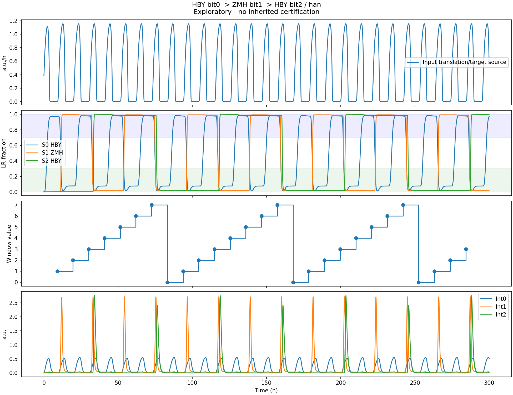

# wiki

## 1. 页面主线与建模状态 (Page Main Line & Status)

### 1.1 页面主线 (Page Flow)

```
1. Carry 的接口要求与模型/架构多维比较 
            ↓
2. Bit 0 → Bit 1：FFL 二级级联完整结果 
            ↓
3. 三级级联：FFL模型与游离重组酶生化动力学模型的连接
            ↓
4. 理想状态下的三级级联验证 (In-Silico Multi-bit Validation)
            ↓
5. 两种泄漏抑制设计 (Leakage Mitigation )
            ↓
6. 鲁棒性、参数分级、实现边界与架构选择
```

### 1.2 建模状态与分层证据链 (Status & Evidence Stages)

|**阶段 / 模块**|**状态**|**对应模型与参数/版本声明**|
| --| ----------------| ---------------------------------------------------------------|
|**前提继承**|已完成|继承单 Bit 拓扑开关模型|
|**接口与模型比较**|已完成|约化 ODE 模型 vs 34/51 状态扩展模型|
|**Bit 0 → Bit 1 级联**|已完成|PB 阶跃用于单次触发演示；曾同学现行二级代码使用归一化 C31 蛋白浓度。第 5 节混合模型的 bit0 另使用韩亚轩 C31 mRNA 与实际翻译通量|
|**三级模块连接与验证**|已完成确定性模型验证|HBY bit0 → 曾同学现行 Python 参数的 A0/R0＋bit1 → HBY A1/F1＋bit2；韩上游驱动，300 h 连续模 8 读出。模块来源和单位见第 5 节|
|**三级失效诊断**|问题已识别|诊断提前进位、写入不充分(n\=4)及过度穿越/相位偏移|
|**泄漏抑制 (方案 A & B)**|方程与逻辑验证|负自馈 + 杂合启动子 AND 门 (​`n_A1_gate=6`​,​`clock 0.3/2.0`)|
|**多位计数验证**|按模型分别验证|原 51 状态扩展模型在早期基础参数下运行 600 h、取得 48 个稳态读数；本页新增的 34 状态混合模型采用曾同学现行 Python 中间位参数，运行 300 h、取得 19 个稳态读数。两组认证不互相转授|

## 2. 系统规范与继承前提 (System Definitions & Prerequisites)

### 2.1 继承的接口与前提

本模型建立在 **单 Bit 的拓扑动力学** 基础之上。整合酶 Int 与方向性因子 RDF 驱动的 PB \<-\> LR 拓扑重组速率方程、热力学构象修饰参数及 BM3R1 时间延迟网络。

### 2.2 状态与编码规范 (Binary State & Bit Order)

为消除位序混淆，本项目统一规范如下：

- **Bit 编号与高低位**：Bit 0 为最低有效位 (LSB)，Bit 1 为中间位，Bit 2 为最高有效位 (MSB)。
- **二进制向量表达**：定义状态向量为 (Bit 2, Bit 1, Bit 0)。

  - 例如状态 (0,0,1) 表示：Bit 2 \= 0 (PB 态), Bit 1 \= 0 (PB 态), Bit 0 \= 1 (LR 态)。
- **8 阶段计数映射**​：P1 (0,0,1) -\> P2 (0,1,0) -\> P3 (0,1,1) -\> P4 (1,0,0) -\> P5 (1,0,1) -\> P6 (1,1,0) -\> P7 (1,1,1) -\> P8 (0,0,0)。

### 2.3 进位事件定义 (Carry Trigger Event)

- **Carry Trigger Event**​：当 Bit i 发生 **LR -\> PB (即从 1 复位归零至 0)**  的下跳沿时，触发进位信号产生；而当 Bit i 发生 PB -\> LR (0 -\> 1) 时，不触发进位。

### 2.4 读出与事件判定标准 (Readout & Event Definitions)

为严格判定“无误进位”与逻辑正确性，设定量化判据如下：

- **读窗 (Read Window)** ：每个时钟周期谷值附近总宽约 20%（谷值前后各约 10%）。原 51 状态模型按上游 C31 通量定位谷值；第 5 节混合模型按本组成熟 Int0 的相邻峰定位谷值，周期与窗口实际小时数应分别报告。
- **读带 (Read Band)** ​：0.30 / 0.70。位标签在高带占比 \>\= 0.80 记为 1，低带占比 \>\= 0.80 记为 0。
- **承诺度 (Commitment)** ：读窗内状态落在读带内的比例，验证冻结点承诺度为 1.0。
- **稳态读数 (Steady-state Readouts)** ：丢弃首个完整计数周期后提取稳态读窗（例如 600 h 包含 56 个读窗，丢弃前 8 个后得 48 个稳态读数，未标注窗为 0）。

### 2.5 跨模型逻辑一致性 (Cross-model Consistency)

两套已有模型使用相同的二进制位序和 P1–P8 逻辑，但状态变量、输入与参数版本不同，不能仅凭码串相同声称动力学等价。第 5 节给出一次实际的跨模型连接：保留曾同学现行代码中的第一级前馈环与 bit1，并用游离重组酶生化动力学模型的 bit0 和 bit2 在两端提供输入及接收。该连接使用新的 34 状态布局和独立验收规则。

## 3. Carry 接口要求与模型/架构比较 (Carry Interface & Model Comparison)

### 3.1 Carry 信号的接口要求与对应指标

- **单次触发性 (Single-Pulse Triggering)** ：每次归零事件必须严格对应单个进位窗口与高位单次翻转（配对无剩余）。
- **作用窗口与动态范围**：进位输入需在合适时段提供足够的写入作用，同时限制写入后的残余作用（Hill 系数 K 为半饱和参数而非硬阈值）。
- **保持裕量 (Setup / Hold Margin)** ：写完后需保证驻留期内不发生反向通量穿越。

### 3.2 FFL模型与游离重组酶生化动力学模型对比

#### 一、**前馈环脉冲进位级联模型（I1-FFL）**

##### 1. FFL 脉冲生成逻辑与双分支机制

- **进位触发条件**​：当 Bit 0 完成 LR -\> PB (复位归零) 时，恢复表达激活因子 A0。

**双分支时序差**：

- **快速分支 (Direct Activation)** ：A0 迅速拉高下一级整合酶 Int1 的转录/表达。
- **慢速分支 (Delayed Repression)** ：A0 延迟激活阻遏因子 F0 (在代码中为 F0)，随着 F0 超过阈值后关断 Int1 的生成。
- **脉冲形成**：挤出一个有限宽度的非对称 Int1 窄脉冲，确保 Bit 1 仅精准翻转一次。

##### 2. 级联动态表达方程

**产生速率与表达方程**：

$$
\frac{dA_0}{dt} = \alpha_A \cdot [Bit0_{PB}] - \gamma_A A_0
$$

$$
\frac{dR_0}{dt} = \alpha_R \frac{A_0^{n_1}}{K_1^{n_1} + A_0^{n_1}} - \gamma_R R_0
$$

$$
Pulse(Int_1) = \alpha_{int} \frac{A_0^{n_2}}{K_2^{n_2} + A_0^{n_2}} \cdot \frac{K_3^{n_3}}{K_3^{n_3} + R_0^{n_3}}
$$

##### 3. FFL 二级级联完整仿真结果 (L2 / L3 验证)

- **Panel 1 (Bit State 轨迹)** ​：展示 Bit 0 归零时，Bit 1 接收到 Int1 进位脉冲并完成单次精准 0 -\> 1 翻转的完整轨迹。
- **Panel 2 (因子动态变化)** ：展示 A0 快速上升与 F0 延迟关断的时间差窗口。
- **Panel 3 (Int1 进位脉冲与成熟态波形)** ：展示经过成熟延迟 (约 20 min) 后的 Int1 窄脉冲波形。

‍

#### 二、游离重组酶生化动力学模型

这个模型在进位结构中加入表达和结合过程。每个位使用十一状态：Int、内部阻遏蛋白 T 和 RDF 各自的 mRNA、未成熟态和成熟态，加上 Int–RDF 复合物 $C$ 与 DNA 状态 $S$。

其主要作用过程为：

$$
M_I\rightarrow I_u\rightarrow I,\qquad I+R\rightleftharpoons C,\qquad PB\rightleftharpoons LR.
$$

游离 Int 推动正向重组；RDF 与 Int 形成的复合物支持反向重组。结合会改变可用的游离分子池，内部阻遏蛋白则控制 RDF 的积累时序。DNA 构型和这些分子池共同影响下一次脉冲的响应。这里的结合与 Hill 重组项是有效动力学描述，尚未展开所有 DNA 联会和构象中间态。

#### 三· 对比

完整三位版本保留两级 I1-FFL，包含三个十一状态位、两套六状态前馈表达链及六个上游状态，共 51 状态。它与约化模型关注同一个计数问题，区别主要在表达、成熟和结合过程展开到什么程度。

| 比较项 | I1-FFL 约化模型 | 游离重组酶生化动力学模型 |
|---|---|---|
| 表达过程 | 直接描述蛋白产生与清除 | 显式描述 mRNA、未成熟态和成熟态 |
| 反向重组驱动 | Int 与 RDF 的乘积响应 | 动态复合物浓度及游离池消耗 |
| 进位机制 | 激活与延迟抑制形成暂态输入 | 保留前馈结构，并检验表达、结合及时钟门的影响 |
| 在混合模型中的具体作用 | 提供现行第一级前馈环和中间位 | 提供混合模型的两端及第二级前馈表达网络 |

两种层级各有用途。并在之后的实际模块连接检验它们能否协同工作

‍
|**比较维度**|FFL**进位模型**|**游离重组酶生化动力学模型**|
| --| -------------------------------| --------------------------------------------------------------|
|**表达链精细度**|粗粒化至蛋白质直接表达|显式建模 mRNA -\> 未成熟蛋白 -\> 成熟蛋白 (含成熟延迟)|
|**复合物与池消耗**|乘积代数响应|显式 Int-RDF 结合/解离方程与游离分子池消耗|
|**输入驱动源**|PB 理想阶跃用于单次机制演示；归一化 C31 蛋白浓度|上游 C31 mRNA 与翻译通量驱动扩展模型 bit0；混合模型在第 5 节单列|
|**抑漏与门控拓扑**|基础 I1-FFL 前馈环|负自馈 + 时钟 AND 杂合门控 (​`n_A1_gate=6`​,​`clock 0.3/2.0`)|
|**适用场景**|快速概念验证 (PoC) 与参数扫描|拟实动态仿真、泄漏诊断与接口匹配审计|

## 4. 多级级联方程

### 4.1 Bit 0 → Bit 1：FFL 二级级联完整结果 (Bit 0 → Bit 1 FFL Cascade)

> **目标**：以 FFL (非相干前馈环) 进位模型为主体，展示 Bit 0 到 Bit 1 的完整进位逻辑、ODE 动力学以及单次精准进位触发过程。

#### 4.1.1完整二级级联ODE方程组与方程解释

- **单 Bit 拓扑重组与延迟网络**

  对于第 $i$ 个 Bit（$i \in \{0, 1, 2\}$），设定 $PB_i + LR_i = 1$：

$$
\frac{d[PB_i]}{dt} = -v_{\text{fwd}, i} + v_{\text{rev}, i}
$$

$$
v_{\text{fwd}, i} = k_{\text{fwd}} [PB_i] \cdot \left(\frac{[Int_i]^2}{K_{D,\text{int}}^2 + [Int_i]^2}\right) \cdot \left(\frac{K_{\text{inh}}}{K_{\text{inh}} + [RDF_i]}\right)
$$

$$
v_{\text{rev}, i} = k_{\text{rev}} [LR_i] \cdot \left(\frac{([Int_i] \cdot [RDF_i])^2}{K_{D,\text{comp}}^2 + ([Int_i] \cdot [RDF_i])^2}\right)
$$

$$
\frac{d[Rep_i]}{dt} = \alpha_{\text{bm3}} [PB_i] - \gamma_{\text{bm3}} [Rep_i]
$$

$$
\frac{d[RDF_i]}{dt} = \alpha_{\text{rdf}} [LR_i] \cdot \left( \frac{1}{1 + \left(\frac{[Rep_i]}{K_{\text{bm3}}}\right)^n} \right) - \gamma_{\text{rdf}} [RDF_i]
$$

- **I1-FFL 前馈环进位脉冲网络（Bit** **$i \to i+1$** **级联）方程**：

  当第 $i$ 位完成翻转归零（$\text{LR} \to \text{PB}$，即 $PB_i$ 恢复为 1）时，组成型启动子开始表达激活因子 $A_i$：

  $$
  \frac{dA_0}{dt} = \alpha_A \cdot [Bit0_{PB}] - \gamma_A A_0
  $$

  $$
  \frac{dR_0}{dt} = \alpha_R \frac{A_0^{n_1}}{K_1^{n_1} + A_0^{n_1}} - \gamma_R R_0
  $$

  $$
  Pulse(Int_1) = \alpha_{int} \frac{A_0^{n_2}}{K_2^{n_2} + A_0^{n_2}} \cdot \frac{K_3^{n_3}}{K_3^{n_3} + R_0^{n_3}}
  $$

- **输入驱动**：Repressilator 驱动产生 $Int_0$ 方波/振荡脉冲。

#### 4.1.2 FFL 二级级联完整仿真结果 (L2 / L3 验证)

- **Panel 1 (Bit State 轨迹)** ​：展示 Bit 0 归零时，Bit 1 接收到 Int1 进位脉冲并完成单次精准 0 -\> 1 翻转的完整轨迹。
- **Panel 2 (因子动态变化)** ：展示 A0 快速上升与 F0 延迟关断的时间差窗口。
- **Panel 3 (Int1 进位脉冲与成熟态波形)** ：展示经过成熟延迟 (约 20 min) 后的 Int1 窄脉冲波形。


### 4.2 游离重组酶生化动力学模型的表达与重组方程

在约化模型的基础上，我们进一步区分蛋白的表达成熟过程，以及游离整合酶、RDF与复合物之间的转换。独立三位模型保留两级carry进位结构，每级进位门沿用非相干前馈的门结构，把调控蛋白展开为完整表达链。每个位采用11个连续状态：

$$
x_i=\left(M_i^I,I_i^u,I_i,\;M_i^T,T_i^u,T_i,\;M_i^R,R_i^u,R_i,\;C_i,S_i\right),
\qquad i=0,1,2.
$$

其中，$I_i$ 为成熟游离整合酶，$T_i$ 为位内阻遏蛋白，$R_i$ 为RDF，$C_i$ 为Int–RDF复合物；$S_i$ 为LR比例，$PB_i=1-S_i$。上标 $u$ 表示未成熟蛋白，$M$ 表示对应转录本。

进位网络另外使用激活因子 $A_j$ 和抑制因子 $F_j$，其中 $j=0,1$ 分别对应 bit0→bit1、bit1→bit2。$F_j$ 与位内RDF不是同一分子池。

#### （1）转录、翻译与成熟

对于采用表达链展开的蛋白 $X$，有：

$$
\frac{dM_X}{dt}=b_X(t)-\lambda_{m,X}M_X,
$$

$$
\frac{dX^u}{dt}=k_{\mathrm{tl}}M_X-\lambda_{u,X}X^u,
$$

$$
\frac{dX}{dt}=k_{\mathrm{mat},X}X^u-\gamma_X X.
$$


$$
b_X(t)=u_X(t)\,\frac{\lambda_{m,X}\lambda_{u,X}}{k_{\mathrm{tl}}k_{\mathrm{mat},X}}.
$$


$$
k_{\mathrm{mat},X}X_{\mathrm{ss}}^u=u_X.
$$

#### （2）位内调控与整合酶输入


$$
H(x;K,n)=\frac{x^n}{K^n+x^n},\qquad G(x;K,n)=1-H(x;K,n).
$$

位内阻遏蛋白由PB状态驱动，RDF由LR状态驱动并受到阻遏：

$$
u_i^T=\alpha_{\mathrm{rep}}(1-S_i),
$$

$$
u_i^R=\alpha_{\mathrm{rdf}}S_iG(T_i;K_{\mathrm{rep}},n_{\mathrm{rep}}).
$$


$$
u_1^I=\alpha_{\mathrm{Int},0}g_0,\qquad u_2^I=\alpha_{\mathrm{Int},1}g_1.
$$

设上游C31转录本为 $m_{31}$，浓度换算系数为 $\kappa$，则：

$$
M_0^I=\frac{m_{31}}{\kappa},\qquad
\frac{dM_0^I}{dt}=\frac{1}{\kappa}\frac{dm_{31}}{dt}.
$$


$$
\frac{dI_0^u}{dt}=\frac{\varphi_{\mathrm{C31}}(t)}{s}-\lambda_{u,I}I_0^u,
$$


#### （3）游离Int、RDF与显式复合物

Int与RDF结合形成复合物，解离后返回游离池：

$$
B_i=k_{\mathrm{on}}I_iR_i,\qquad D_i=k_{\mathrm{off}}C_i.
$$

因此，成熟态方程为：

$$
\frac{dI_i}{dt}=k_{\mathrm{mat},I}I_i^u-\gamma_{\mathrm{int},i}I_i-B_i+D_i,
$$

$$
\frac{dR_i}{dt}=k_{\mathrm{mat},R}R_i^u-\gamma_{\mathrm{rdf}}R_i-B_i+D_i,
$$

$$
\frac{dC_i}{dt}=B_i-D_i-\delta_C C_i.
$$


#### （4）DNA正向与反向重组

将完整重组通量记为：

$$
J_{\mathrm{fwd},i}=k_{\mathrm{fwd}}(1-S_i)
H(I_i;K_{D,\mathrm{int},i},2)\frac{K_{\mathrm{inh}}}{K_{\mathrm{inh}}+R_i},
$$

$$
J_{\mathrm{rev},i}=k_{\mathrm{rev}}S_iH(C_i;K_{\mathrm{complex}},2).
$$

DNA状态满足：

$$
\boxed{\frac{dS_i}{dt}=J_{\mathrm{fwd},i}-J_{\mathrm{rev},i}}
$$


$$
q=\frac{k_{\mathrm{on}}}{k_{\mathrm{off}}+\delta_C},\qquad
K_{\mathrm{complex}}=qK_{D,\mathrm{comp}}.
$$

当复合物满足准稳态近似 $C_i\approx qI_iR_i$ 时，有：

$$
H(C_i;qK_{D,\mathrm{comp}},2)\approx H(I_iR_i;K_{D,\mathrm{comp}},2).
$$


## 5. 三级级联：FFL模型与游离重组酶生化动力学模型的连接

### 5.1 3-Bit 级联拓扑架构与二进制逻辑

- **级联链路**：Bit 0 -(Int1)-\> Bit 1 -(Int2)-\> Bit 2。

本节中的“连接”指在同一次 ODE 积分中让前一级的实际状态驱动后一级，并非将两套独立结果图拼接。为避免混淆，以下称新结构为**34 状态混合三级模型**：

| 模块 | 状态数 | 来源与职责 |
|---|---:|---|
| Bit 0 | 11 | 游离重组酶生化动力学模型；上游 C31 mRNA 与实际翻译通量驱动 Int0，包含表达成熟、Int–RDF 显式复合物和 DNA 状态 |
| A0/R0＋Bit 1 | 2＋4 |   **利用FFL二级现行参数与约化方程**；A0/R0 把 bit0 回零转换为 Int1 脉冲，Int1 驱动 bit1。此处 R0 是前馈抑制蛋白，不是 bit1 的 RDF |
| A1/F1＋Bit 2 | 6＋11 | 游离重组酶生化动力学模型；bit1 的 PB 状态及同源 Int0 时钟控制 Int2 的表达，再由 bit2 的完整表达与重组方程接收 |

上游振荡器采用理想方波和仿真接口预先积分两种形式进行检验，作为 bit0 的上游输入
事实上，总而言之：

* 混合级联通过“脉冲写入—电平保持—进位脉冲生成”的重复过程传递计数信息。bit0 将周期输入转换为交替保持的 DNA 状态；第一级前馈环将其回零转换为 Int1 脉冲，驱动 bit1 完成下一位写入；bit1 回零后，第二级前馈环与时钟门再产生 Int2 输入，驱动 bit2。

### 5.2 两处实际连接接口

第一处由游离重组酶生化动力学模型中的 `S_0=LR_0` 向前馈环提供 `PB_0=1-S_0`。A0 受 PB0 驱动，R0 随 A0 积累并压低 Int1 产生。Int1 进入曾同学 bit1 的约化重组方程；这一段沿用FFL二级级联代码中的各项对应参数，包括位专属的 Int1、Rep1 与 RDF1 参数。

第二处由FFL bit1 的 `PB_1` 驱动游离重组酶生化动力学模型中的 A1/F1 表达网络。第二级时钟门读取**同一混合模型 bit0 的成熟游离 Int0**，有效门与 Int2 的目标产生速率为：

$$
g_1(t)=H(A_1;1.2,6)\,G(F_1;0.4,4)\,H(Int_0;0.3,2),\qquad
u_{I2}(t)=38\,g_1(t)\;\mathrm{a.u./h}.
$$

其中 $H$、$G$ 分别表示激活和抑制型 Hill 函数。`n_A1_gate=6` 只作用于 Int2 门；F1 产生臂的指数仍为 4。$u_{I2}$ 是**目标成熟产生速率**，会先映射到 bit2 的 mRNA 方程，再经历未成熟蛋白、成熟游离 Int2 及 Int–RDF 结合；它不是人为指定的成熟 Int2 浓度波形。

注：时钟门的 `0.3/2` 与独立指数 6 属于游离重组酶模型的选定配置，不能算作FFL原二级级联已验证的参数。（详见第8节）

### 5.3 phiC31上游驱动下的混合三级结果

固定上述参数后，运行 300 h，未通过搜索参数来选择本次结果。以相邻 Int0 峰间谷为中心读取 DNA 状态，每个读窗总宽约为一个时钟周期的 20%；LR 比例不高于 0.30 记 0，不低于 0.70 记 1，每个位至少 80% 的窗口样本须落在相应带内。得到 27 个连续可判定读窗：

```text
1 2 3 4 5 6 7 0 | 1 2 3 4 5 6 7 0 | 1 2 3 4 5 6 7 0 | 1 2 3
```

每个读窗中三个位的最低承诺度均为 1.0。丢弃首个完整模 8 周期后，余下 19 个读窗仍逐拍递增。bit0、bit1、bit2 的 DNA 状态在 300 h 内分别穿越 0.5 共 29、14、7 次，体现逐级约二分频。
仿真上游振荡器接入结果表明，在当前参数下，这些状态保持与进位生成过程能够按顺序衔接，从而形成三级计数。




### 5.4 进位因果、数值复算与证据边界
具体来说，主要检查了每次低位回零后，进位信号和高位翻转是否按顺序发生。在 300 h 仿真中，bit0 的 14 次反向重组分别对应 14 次第一级进位信号和 14 次 bit1 翻转；bit1 的 7 次反向重组则对应 7 次第二级进位信号和 7 次 bit2 翻转。将每一级最初两次进位作为启动阶段单列后，其余事件均满足一一对应、先后顺序正确，且高位正反向交替翻转。读窗与相邻状态转换之间的最小时间间隔约为 1.18 h，出现在 bit0 读窗结束到下一次翻转之间。
为检查结果是否受到计算精度影响，我们收紧了积分容差，并将输出采样间隔从 1 min 缩短到 0.5 min。两种设置得到的计数序列和进位判断一致。随后，从稳定运行的轨迹中选取代表数字 0–7 的八组完整生化状态，保留各自对应的上游时钟相位，再分别运行 300 h。八组都从预期的下一个数字开始，继续完成正确计数。
还检查了两次进位之间的残余重组作用。将一次正向和一次反向进位配对，并按 Int2 峰值的 5% 划分脉冲尾部后，远离脉冲时的错误方向重组量与门开启时预期方向重组量之比，（中位数约为 0.0128。这一数值用于描述模型中的残余作用，不代表细胞的误进位概率。具体计算方法和结果见[混合模型认证报告](hby_zmh_hby/certification/认证结果说明.md)。）
这些检查支持：在当前参数和输入条件下，混合模型能够稳定完成确定性三级计数。 不过，八组初态都来自已经稳定运行的轨迹，尚不能说明模型能承受任意初态、参数波动或分子噪声。原参与混合模型的独立部分做过的参数鲁棒性等测试，也不能直接作为这个混合模型的证据，需要针对新结构另行验证。
## 6. 理想状态下的三级级联验证 (In-Silico Multi-bit Validation)

### 6.1 FFL进位模型：P1–P8 逻辑闭环 

- **理想化波形验证**：展示约化模型在理想脉冲驱动下，3-Bit 逻辑计数器在 P1\~P8 8 阶段的典型二进制循环波形。

- **输入驱动**：Repressilator 驱动产生 $Int_0$ 方波/振荡脉冲。

### 6.2 核心瓶颈：静态等待期的提前泄漏 (Early Leakage)

- **失效诊断现象**：在 P2 $(0,1,0)$ 到 P3 $(0,1,1)$ 的静态等待阶段，上游激活因子 $A_1$ 的稳态表达持续存在，导致 $Int_2$ 出现底噪积累。

**系统故障模式**：

1. **False Carry (误进位)** ：$Int_2$ 底噪超过重组阈值，导致 Bit 2 在未收到进位信号时提前触发翻转。
2. **Back-tracking (状态回退)** ：过量 $Int_1/Int_2$ 底噪引发 Bit 1 非预期的反向重组。

## 7. 两种泄漏抑制设计 (Leakage Mitigation )

### 7.1 方案 A：A1 蛋白负自馈调控 (Negative Autoregulation)

- **机制与方程修饰**：将激活因子 A1 的启动子改造为带负反馈关断的启动子：  

  $$
  \frac{dA_1}{dt} = \alpha_A \cdot [Bit1_{PB}] \cdot \frac{K_{auto}^{m}}{K_{auto}^{m} + A_1^{m}} - \gamma_A A_1
  $$
- **实测抑漏表现**​：实测表明 A1 臂在静态期并未降至 0（A1/K\_A1 中位数约为 0.94，长时间停留在半饱和点附近），其主要作用是压低 A1 的峰值稳态，与方案 B 形成协同。

### 7.2 方案 B：Int0 与进位信号的杂合启动子 AND 门 (Hybrid Promoter AND Gate)

- **机制与方程修饰**：将 Int2 的表达限制于外源主时钟脉冲 Int0 与上游进位信号 A1/F1 的协同 AND 逻辑：  

  $$
  Pulse(Int_2) = f(A_1, R_1) \cdot \frac{Int_0^{p}}{K_{clock}^{p} + Int_0^{p}}
  $$
- **正名说明**：正名为**杂合启动子 AND 门**（拆分整合酶 Split-Integrase 仅作为未来的物理候选形态之一，模型本质为时钟 AND 逻辑门）。

## 8. 优化后 3-Bit 计数验证 (In-Silico P1–P8 Validation)

>  **边界声明**：本章展示的 8 阶段二进制循环计数均属于 **理想化 ODE 数学模型 (In-Silico)**  验证结果。

### 8.1 FFL三级级联结果

#### 8.1.1 完整 8 阶段二进制循环计数 (P1\~P8)

- **仿真波形验证**​：展示方案 A 与方案 B 作用下，3-Bit 逻辑计数器在 P1\~P8 阶段无误进位、无回退的完整波形。

#### 8.1.2 动态脉冲对齐与状态转换时序

- **时序拆解**：展示 $Int_0$ 时钟脉冲、$Int_1$ 及 $Int_2$ 进位窄脉冲在 8 个阶段中的精准时间对齐轨迹。
### 8.2 游离重组酶51状态生化ode模拟结果


#### 8.2.1 为什么选择 `n_A1_gate=6`

在独立51状态模型中，我们扫描了 `n_A1_gate=4、5、6、7、8`。每个指数对应四种表达设置：carry1 mRNA半衰期为2或4 min，A1/F1共同成熟半衰期为32.5或60 min，共20个点，每点运行600 h。F1产生指数保持4，其余基础配置一致。

为了避免只按峰值评价进位，我们将一次正向和一次反向写入组成配对周期，统计远驻留期错误方向通量相对于门开窗内有效写入通量的比值 $L_{\mathrm{symmetric}}$。该指标把脉冲衰减尾部单列；值越低，表示该定义下的远驻留错误作用越小。

| 第二级激活门指数 | 四种设置中通过原51态判据的数量 | 配对泄漏指标中位数 |
|---|---:|---:|
| 4 | 0/4 | 0.44887 |
| 5 | 4/4 | 0.05206 |
| 6 | 4/4 | 0.01688 |
| 7 | 4/4 | 0.01385 |
| 8 | 4/4 | 0.01305 |


在已测网格内，指数4未获得完整计数，5至8均有通过点。选择6的理由是：从5提高到6，配对泄漏指标中位数降低约68%，约为原来的三分之一；继续从6提高到7只再降低约18%，从7到8约降低6%。在1%、5%、10%三种尾部切阈下，泄漏排序一致。因此选择收益已明显开始变缓的6作为后续工作点，避免为了较小的追加改善继续提高模型要求的有效响应陡峭度。

这一选择是所测范围内的工程折中。6不是唯一能计数的值，也不是泄漏最低值；离散扫描同样不能证明5是连续参数空间中的精确下界。这里没有将有效Hill指数直接解释为某个已构建元件的结合位点数。

#### 8.2.2 选定工作点的连续三级计数

最终工作点采用 `n_A1_gate=6`，carry mRNA半衰期2 min、A1/F1成熟半衰期32.5 min，时钟门为0.3/2。独立的51状态游离重组酶生化动力学模型在该早期基础参数与新增接口配置下运行600 h，取得56个有效读窗；丢弃前8个后，48个稳态读数仍按模8递增。由此，门响应选择既有参数扫描依据，也有选定工作点的连续计数结果支持。

### 8.3 有关混合模型
混合级联的第二级进位网络采用与冻结 51 态模型相同的实现与相同的关键取值——独立门指数 n_A1_gate = 6、F1 产生指数保持基础表值 4、时钟门读取本模型自己的 bit0 成熟游离 Int(clock_K = 0.3、clock_n = 2)。


<!-- ════════ [DSH 注 · HBY 路线内容（与 §9 原文并列，不改动原文）] ════════
§9.1–§9.4 的原文描述的是 **FFL 路线（Zeng 模型）** 的假设、指标、敏感性与实现边界。
以下注释在同一节内**并列**给出 **HBY 游离重组酶路线**（51 状态三级模型 + 混合级联 34 状态模型）
实际做过的参数扫描、鲁棒性检验与实测边界，供并排成文使用；**§9 原文一字未动**。

两条路线在本文中的分工：
  * FFL 路线（§4.1 / §6 / §7 / §8.1）：进位脉冲如何由调控网络**产生**；
  * HBY 路线（§8.2 / §8.3 + 以下注释）：进位信号需要满足**什么条件**，以及把它接进含表达链、
    成熟与显式 Int–RDF 复合物的动力学后，二/三位计数**是否真的成立**。

以下分五块，分别落在 §9 的五个位置；每块内的数字均可在 `final_reconstruction/`、
`跨模型三级连接验证/hby_zmh_hby/`、`.../certification/`、`.../版本与鲁棒性探针/` 溯源。
════════ -->
## 9. 鲁棒性、实现边界和架构选择 (Benchmarking & Boundaries)


### 9.1 模型假设与参数化 (Assumptions & Parameterization)

- **假设条件 (Assumptions)** ：假设细胞内资源（核糖体/RNA 聚合酶）无极化竞争；假设质粒拷贝数均匀分布。

**参数来源分类 (Parameter Classification)** ：

1. **文献测量参数**：整合酶结合速率 $k_{int}$、重组速率 $k_{rec}$ 。
2. **拟合参数**：$BM3R1$ 的 Hill 抑制系数与解离常数 $K_D$。
3. **纯设计变量 (Design Variables)** ：激活/阻遏因子降解速率 $\gamma_A, \gamma_R$、前馈环转录强度比 $\alpha_A/\alpha_R$。

<!-- ════════ [DSH 注 · 并列 §9.1：HBY 路线的参数来源与假设] ════════
【1. HBY 模型的参数是"代码/表格来源设定值"，不是实测值】
本路线**没有任何实验实测参数**。数值来源有两个：
  * `final_reconstruction/model.py` 的 `ZENG`（早期基础表）—— HBY bit0、A1/F1、bit2 使用；
  * 早期 profile 中的扩展接口假设 —— mRNA/成熟/浓度标尺/时钟工作点。
另有一层**新增的显式结构**：mRNA → 未成熟 → 成熟 表达链，以及显式 Int–RDF 复合物
（`k_on = 0.1 a.u.⁻¹h⁻¹`、`k_off = 1/h`、`δ_C = 1/h`，准稳态映射 `q = 0.05`、
模型读到的 `K_complex = q·K_D_comp = 0.06 a.u.`）。

【2. 参数身份必须三分，否则"表值"与"现行值"会被混用】
| 身份 | 出处 | SHA256 |
|---|---|---|
| ZMH **现行**中间模块（A0/R0 + bit1） | `wiki任务/完整二级级联.py` | `E790743F493F415E43296CD10911BB6C2A4E5A024F70E807A40267E9705A0E2B` |
| HBY 两端与第二级（**早期基础表** + 扩展） | `model.py` 的 `ZENG` | `256D2D104EECB4CE17F27CF4DBC08257BEEEA79E5805FD7D5614E47BBC7E543A` |
| 上游输入（韩亚轩 v53d 参考参数） | `其他小组成员任务/Week4_振荡器-C31建模/code/Flux_Driven_Translation_Burden_Model.py` | `456326A418C4C7EE23C75FA2DD4A86070F37CAF820B5F863BBAA44FE9DCE51BD` |
**混合三级模型的两端仍用早期基础表**，只有中间位用现行 `.py` 值；因此不能标成
"全部采用现行参数"，也不得用现行值覆盖 `ZENG`（会使历史 34/51 态结果与哈希失配）。
现行 `.py` 的值**同样是代码设定值**，只是属于**另一版**设定。

【3. 表内存在但本模型不引用的项】
`k_int = 6.0` 只存在于 `ZENG` 字典、`rhs` 不引用（它是旧方波口径的输入调参量，
**不是整合酶结合速率**）；本代码中**没有 `k_rec` 这个符号**——正/反向重组速率是
`k_fwd = 7.0` / `k_rev = 5.0`，且正向与反向 Hill 的**指数固定为 2**。

【4. 三条必须随文保留的物理边界】
* `uM_per_au = 5.75` **未标定**：绝对浓度与拷贝数换算线性依赖它（已测容忍度见 §9.2 注释）。
* `translation_h` **结构性不可观测**：取 30 与 45 时，除 mRNA 外全部状态最大差 **1.08e-13**
  ⇒ 只能按假设固定，不能称"标定"。
* **生长/稀释一致性未解决**：上游 Td = 50 min ⇒ μ ≈ ln2/50 ≈ **0.832 /h**，而下游部分清除率为
  **0.6 /h**；若视为同一细胞生长条件，隐含内禀降解率将为**负**。`add_growth = False`
  只表示下游方程不重复计入稀释，**不表示细胞不生长**。

【5. 一条结构性假设】HBY 模型假设**各位完全正交、不含跨位作用项**
（`K_D_int = (1.0, 1.0, 0.6)` 为三个人工值），因此它对标的是三个**理想**正交模块。
════════ -->
### 9.2 成功评估指标与鲁棒性测试 (Benchmarking Metrics)

定义计数器运行成功与否的量化评估标准：

- **False Carry Rate (误进位率)** ：静态等待期未发生归零事件时下级 Bit 翻转的概率（目标 $< 1\%$）。
- **Missing Carry Rate (漏进位率)** ：发生归零事件时下级未能在时间窗口内翻转的概率（目标 $< 1\%$）。
- **Carry Delay Window (**​**$\tau_{delay}$**​ **)** ：进位脉冲峰值与上级归零沿之间的时间差。
- **周期通过率 (Pass Rate)** ​：计数器无故障连续完成 P1\~P8 完整 8 阶段循环的参数空间比例。

<!-- ════════ [DSH 注 · 并列 §9.2：HBY 路线的成功判据与已完成的鲁棒性检验] ════════
【判据定义（与 FFL 路线的"率"是不同口径，两者不可互换）】
HBY 路线的 `certified` 是**一条 600 h 确定性轨迹**上的布尔值：
`steady ∧ one ∧ order ∧ alt ∧ contrast`；**它不是率、不是成功率**。
混合级联模型另有同构的新判据 `HZH_MOD8_CAUSAL_V1`（`certified_v1`），按 34 态的**状态名与模块边界**
取数、**不复用 51 态的硬编码索引**，且**不使用** 51 态旧版的 off/on 门峰值比作为否决项。
另有一个**不含泄漏阈值**的并列标签：`counting_and_causality_passed := steady ∧ one ∧ order ∧ alt`。

【已完成的鲁棒性 / 验证检验（全部确定性，可直接引用）】
| 检验 | 结果 |
|---|---|
| 池扰动（51 态，600 h） | **136** = 128 恢复 + 8 合法模 8 相移 + **0 失锁** |
| 八个轨道初态（51 态） | **8/8** |
| 八个完整生化初态（混合 34 态） | **8/8**，各自继续 300 h，首次新读数均为 `(初始值+1) mod 8` |
| 严格容差（51 态） | **5 点 × 3 档 = 15/15**；输出网格轴 **2/2** |
| 数值收敛（混合 34 态） | 2e-7 / 1e-9 / 1e-11 与 0.5 min 输出网格四层，码串·事件数·因果结论**完全一致**（全 34 维最大绝对差 6.0e-13 – 7.3e-13） |
| 静态容差 21 点（51 态） | 历史 `certified` **14/21**；`counting_and_causality_passed` **18/21** |
| 已测对称认证宽度 | `conc_scale = 0.00`、`clock_K = 0.20`、`K_A1 = 0.05` |
| 接口边界探针（混合 34 态） | 单模块初态扰动被遗忘（回到同一条极限环）；上游 10 % 资源负担仍认证；`uM_per_au` ±13 % 仍认证 |

【51 态冻结工作点的计数结果】600 h、56 个读窗；丢弃一个模 8 周期（8 窗）后 **48** 个稳态窗
仍逐拍模 8 递增；两级进位 **14→14→14** 与 **7→7→7**。
setup/hold：bit0 4.030/3.100、bit1 4.638/2.914、bit2 4.539/3.819 h。
**全局受限项是 bit1 的 hold = 2.914 h。**

【混合级联 34 态（HBY bit0 → ZMH 现行 bit1 → HBY A1/F1 + bit2）的计数结果】
300 h、输出网格 1 min：**27 个完整读窗**，码串 `123456701234567012345670123`，
最小 commitment **1.0**，**0 个未标注窗、0 个被边界裁剪窗**；丢弃一个模 8 周期后 **19** 个稳态窗，
`1234567012345670123` 逐拍递增。两级进位：bit0→bit1 **14→14→14**、bit1→bit2 **7→7→7**。
setup/hold：bit0 **5.962/1.178**、bit1 **6.875/1.301**、bit2 **6.117/2.221** h。
**全局受限项是 bit0 的 hold = 1.178 h。**
配对泄漏（描述量）：3 个完整 R/F 超周期，5 % 切尾 `L_symmetric` 中位 **0.012833**
（1 % 0.008411 / 10 % 0.021513）；**未设生物学通过阈值**。

【⚠️ 引用裕量时必须写明是哪一位】
两个模型的受限项不同：51 态是 **bit1 的 hold 2.914 h**，混合模型是 **bit0 的 hold 1.178 h**。
bit2 的 3.819 h / 2.221 h **都不是**绑定值——把某一位的裕量当作"该模型的最小裕量"，
会重演此前 `hold 3.70 h` 那类错误（既非全局 2.914、也非 bit2 的 3.819）。
另外，两个模型的时间裕量都是**相对各自读窗与 0.5 阈值穿越**算出的，**不是实验噪声余量**。

【尚未完成、应随文写明】随机性（分子噪声）下的成功率、参数分布鲁棒性、元件实体标定与湿实验。
51 态侧预审脚本的判定原文为 `SMALL: symmetric static tolerance = 0 (< 0.05).
A stochastic study is REQUIRED before any counting claim.`；
判断随机性优先级的确定性依据见 §9.4 注释（混合模型 bit2 门相最小只有 **2.47 拷贝**）。
════════ -->
### 9.3 全参数敏感性排行 (GSA)

- 结合 Sobol 敏感性分析，列出对“周期通过率”影响最大的 Top 5 生物物理参数。

<!-- ════════ [DSH 注 · 并列 §9.3：HBY 路线的关键参数判别依据（未做全局 GSA）] ════════
【先说结论】HBY 计数级联这一支**没有做过 Sobol，也没有做过 Morris**。
仓库其他目录中确有 Morris+Sobol 结果（`其他小组成员任务/周期旋钮与随机 A→B 接口认证/`、
`其他小组成员任务/GSA_RDF/`），但它们针对**振荡器–C31 机制化 ODE**，输入、方程与工作点都不同，
**不能转授**给本计数级联。因此本路线不给出"Sobol Top 5"式的排行。

【已实际完成、可用于判别关键参数与不可辨识方向的定向证据（8 项，全部可溯源）】
1. **阈值余量审计**：18 项操作比 `x/K` 与贴阈值时间。**仅 1 项被标记** —— `carry1 H(A1 ; K_A1)`，
   门臂比值中位数 **0.9417**、**52.7 %** 时间贴近阈值（该臂自身定义要求非进位期应 ≈ 0）；
   对照 n = 4 时 **16/18** 被标记。⇒ 冻结点上 A1 臂长期位于半饱和点附近，非进位期的低作用
   是由 **F1 抑制臂 × Int0 时钟 AND** 承担，而非"A1 被压到阈值以下"。
2. **门指数定向扫描**：`n_A1_gate ∈ {4,5,6,7,8}` × 4 组表达设置 = **20 点 / 600 h**；
   `L_symmetric` 排序在 1 / 5 / 10 % 三档切尾下一致为 **8 < 7 < 6 < 5 ≪ 4**；
   逐步比值（4 点中位数口径）5→6 = 3.084×、6→7 = 1.219×、7→8 = 1.062×。
3. **两臂对照（加长 vs 加陡）**：**44 点**，每点只改一处。
4. **门指数 × A1 成熟度**：**25 点 / 400 h，25/25 认证** —— 两者存在**可互换区间**
   ⇒ `n_A1_gate = 6` **不是**可独立辨识的分子量。补偿量有两个不可混用的口径：
   切线型 23.638–23.812 min/单位 n（仅无穷小步长成立）、割线型 17.237–31.789（有限问题用割线）。
5. **泄漏指标的判别力审计**：认证 16 点 vs 失败 4 点，泄漏比值中位数 **0.0388 vs 3.59**（约 93 倍）。
   另注：泄漏必须用**配对 R/F 超周期**口径 —— 单窗口径的离散度是 **2.87×10⁶ 倍**，
   配对口径下是 **0.08 %**。
6. **局部可辨识性**（**仅 1–2 % 步长窗口内**，阈值 `σ > 1e-3·σ_max`）：有效秩 **9**
   （最小奇异值仅以 **4.71×（理论）/ 2.16×（实验）** 越过该切点；换到 `1e-2` 则降为 7 / 6）；
   条件数 **212.5（理论）/ 462.5（实验）**；最弱方向由 `carry1_mrna_half_life_min` 主导
   （±0.978，**符号任意** —— 它是奇异向量），A1/F1 成熟半衰期与复合物参数为其**补偿伙伴**。
   （更早一次因**工作点混用**被判 `FAILED_ACCEPTANCE` 的运行已被本次取代；
   其 `rank 8/9/9`、`cond 1237/575/84`、`σ₁ 2481/1572/988` 为被撤的 before 值，不得引用。）
7. **`translation_h` 结构性不可观测**：取 30 与 45 时，除 mRNA 外全部状态最大差 **1.08e-13**。
8. **RDF 反馈的必要性探针**：切断该门后，最长正确模 8 段从 **48 个读窗压到 4 个**并丧失认证。

【不得引用】5 % 步长当局部估计（2 %→5 % 全矩阵相对变化 0.171，超过预登记的 0.05）；
裸报"rank 9"（秩是**带阈值**的量）；`q` 与 `K_D_comp` 严格简并；
把 `uM_per_au` 与 `translation_h` 写成一对互不可分辨的参数。

【若确实需要"参数排序"，建议的成本阶梯】
  * **首选**：扩展上述"单参数因子网格" —— 5–6 个旋钮 ≈ **35–42 点 ≈ 3 CPU-h**，
    产出的是**认证宽度**（"该参数在 [a,b] 内可用"），比方差指数更贴合设计窗口的叙事；
  * **次选**：Morris 筛选 —— D = 10、r = 10 ≈ **110 次 ≈ 7.6 CPU-h**，给出重要性排名与交互标记；
  * **Sobol**：仅在确实需要方差分解时做，且**必须先登记输出标量与输入分布** —— 目前两者都没有，
    否则排名反映的是"人为设定的参数区间"，不是生物学。
════════ -->
### 9.4 物理实现边界与实体构建展望

**正交蛋白系统可确定**：

- **低位（Bit 0）：采用** **$\Phi\text{C31}$** **重组酶系统，阻遏蛋白为 BM3R1。**
- **中位（Bit 1）：采用** **$\text{Bxb1}$** **重组酶系统，阻遏蛋白为正交的 PhlF。**
- **高位（Bit 2）：采用** **$\text{TP901-1}$** **重组酶系统，阻遏蛋白为正交的 PsaR。**

> 文献来源于：Weinberg, B. H., Pham, N. H., Caraballo, L. D., Lozanoski, T., Engel, A., Bhatia, S., & Wong, W. W. (2017). Large-scale design of robust genetic circuits with multiple inputs and outputs for mammalian cells. *Nature biotechnology*, *35*(5), 453-462.

- **干/湿实验脱节澄清**：目前 $A_i/R_i$ 仅为逻辑功能因子，湿实验中尚未完成特定正交蛋白的实体映射。模型选择的 n_A1_gate=6  是有效响应陡峭度，不代表已设计出六个结合位点或确定了具体启动子
- **架构选择建议**：基于干实验模型预测，方案 B (Split System) 在抑制静态泄漏方面具有更高的参数容忍度，建议湿实验组优先考虑杂合启动子或拆分整合酶构建方案。

<!-- ════════ [DSH 注 · 并列 §9.4：HBY 路线的实现边界与实测约束] ════════
【1. 本路线模型包含什么、不包含什么】
**包含**：HBY 的 11 态位模块（mRNA → 未成熟 → 成熟 + 显式 Int–RDF 复合物与游离池消耗）、
两级 carry 表达网络、独立门臂指数 `n_A1_gate`、时钟 AND 门。
**不包含**：任何**拆分 / 组装 / 拼接整合酶**的状态与动力学；跨位串扰；
蛋白组装、质粒拷贝数分布与细胞生长条件的联合标定。

【2. 因此"拆分整合酶"在本路线里只是候选实体实现，不是已验证结论】
本模型中的第二级 AND 门实现为**杂合启动子门控**：
`g1 = act(A1; K_A[1], n_A1_gate) · rep(F1; K_F[1], n_F[1]) · clock`，
`clock = act(Int0_mature; 0.3, 2)`。由于缺少拆分动力学与公平对照，本路线**不支持**
"拆分整合酶参数容忍度更高"这类判断。另：模型假设各位**完全正交、无跨位作用项**
（`K_D_int = (1.0, 1.0, 0.6)` 为三个人工值），它给出的是**三个理想正交模块**的结果，
不能当作三套已表征系统的验证。

【3. 让三位成立的实际杠杆（本路线实测）】
不是"有了前馈环即可"，而是**门臂指数**：`n_A1_gate` 独立取 **6**，F1 产生臂指数保持基础表值 **4**。
级间结构不对称：`g0`（bit0→bit1）**没有**时钟门，而 **34 状态二位模型在无时钟的 `g0` 下即已认证**；
三位才需要 `g1` 的时钟 AND 门 ⇒ **进位整形的要求随级联深度上升**。
量化支撑：阈值余量在 n = 4 时 **16/18** 被标记、n = 6 时仅 **1/18**。
又因 `n_A1_gate` 与 A1 成熟度存在可互换区间（25 点 25/25 认证），它是**有效响应陡峭度**，
**不代表已设计出六个结合位点或确定了具体启动子**。

【4. 参数表版本是承重轴（双向实测）】
把冻结 51 态工作点换成曾同学**现行 `.py` 值**后：进位门事件 **14 → 0**、`certified` 由
**True 变 False**；bit1/bit2 的 `S1` 再也不穿越 0.5，门峰值由 0.2255 降至 7.6e-4；
两种共享槽取法（她的 bit1 值 / bit0 值）**都失败**。
对称的另一半已有：混合模型把早期基础表放回中间位同样失败（29/14/7 → 29/5/1）。
⇒ **两个模型各自只在自己那一版参数表上成立；任何跨模型参数搬运都必须先跑这根轴的对照。**
⇒ 且**失败模式不是时序裕量**：变体里 bit1/bit2 没有穿越，**没有裕量可报** ——
只看聚合裕量数字会误判为健康。
⇒ 实测断点在**幅度层**：`g0` 峰值 0.443 → 0.023 → 2.2e-4，
`Int1_source` 峰值 7.97 → 0.41 → 0.0040。

【5. 接口边界探针（混合 34 态，四项全过）】
| 探针 | 杠杆 | 结果 |
|---|---|---|
| P1 | 单模块初态扰动（`RDF1` ×2 / ×0.5、`A1` ×0.5） | **回到同一条极限环**，裕量与门占空比到 15–16 位有效数字与基线相同 |
| P2 | 上游资源负担 0 → **0.10** | 仍认证；读窗 19 → 20；最小裕量仅降 1.5 %（1.17846 → 1.16046 h） |
| P3 | `uM_per_au` 5.00 / 6.50（±13 %） | 仍认证；裕量 −6.5 % / +6.1 % |
⇒ P1 把"八个初态只是相位一致"这条边界向前推了一步：**单模块初态扰动会被遗忘**，
该模型是一条稳定吸引极限环；但这**仍不等于**"任意初态都行"（只覆盖 3 个单模块、4 个预登记扰动）。
⇒ P2/P3 说明"零资源负担"与"浓度标尺"这两条接口假设**在已测档位内不承重**；更高档 / 更宽范围未测。

【6. 分子数下限：随机性研究的优先级】
| 池 | 门相最小 | 门相 p05 |
|---|---:|---:|
| `b2_I`（混合 34 态） | **2.469 拷贝（CV 64 %）** | 10.36（CV 31 %） |
| `b2_I`（冻结 51 态，同口径） | **20 拷贝（CV 22 %）** | 38.6（CV 16 %） |
⇒ 混合模型 bit2 门相池比冻结 51 态低 **8.1 倍**（p05 低 3.7 倍），**更接近单分子区**，
因此**随机性研究的优先级比 51 态更高，不是更低**。同 51 态一样，本节拒绝给出单一"最小池"判决
（门相最小会落到结构性缺席的 `b2_C`）；且拷贝数与未标定的 `uM_per_au` **线性相关**。

【7. 本路线仍缺的边界，应随文写明】
没有参数分布鲁棒性、没有随机噪声、没有元件实体标定、没有湿实验成功率；
读窗 `commitment = 1.0` 是**判据上限**而非噪声胜率；八个初态是**同一确定性轨道上相位一致的
八个完整生化状态**，不是任意非自洽初态的吸引盆测试。
════════ -->
