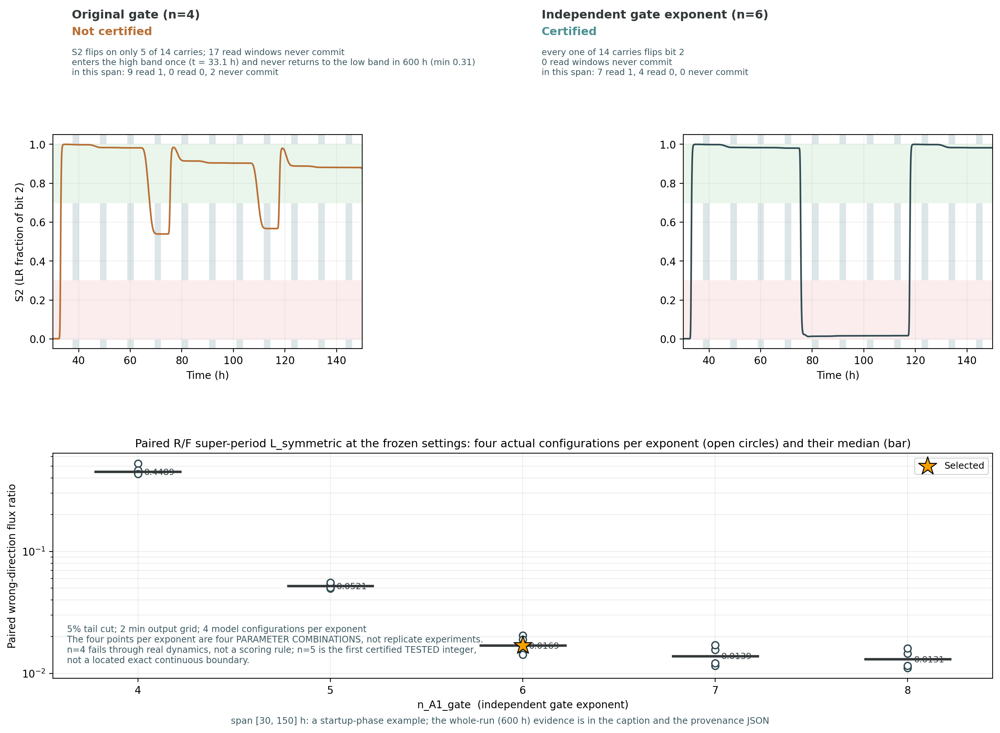
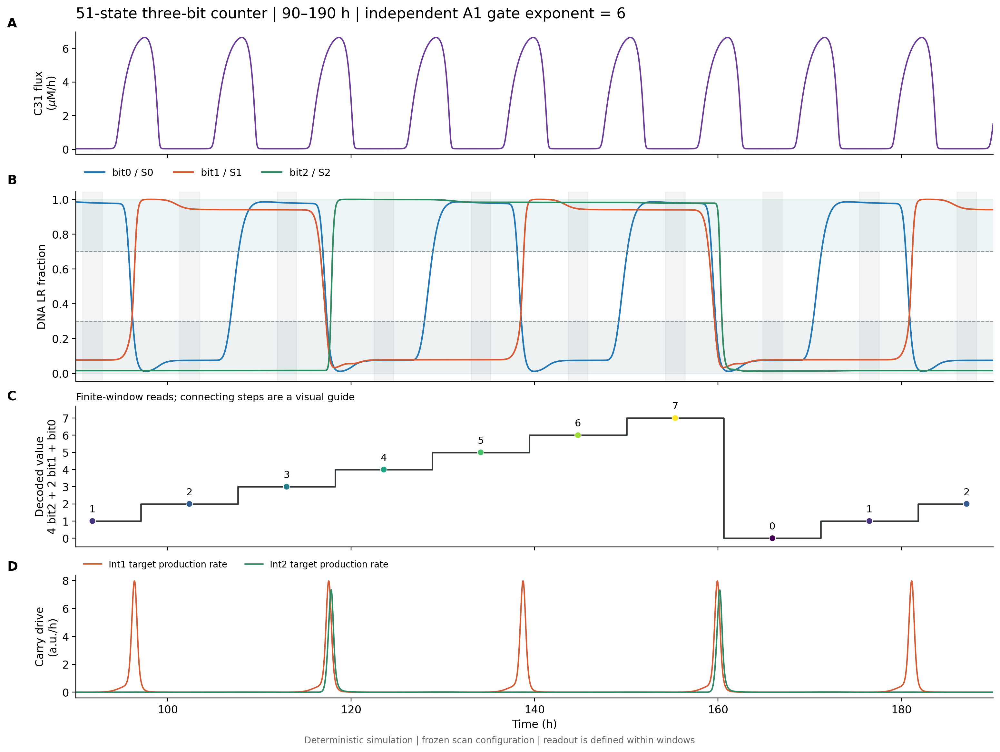

<!-- 独立模型正文，中英逐段对照；供网页组取英文段落发布。对象是冻结的threebit51_selected_v1及其独立51态方程，不是HZH或HZZ。数据图引用已保存产物，图位说明不作为正文显示。 -->

## 游离重组酶生化动力学模型：展开表达、方向性调控与DNA记忆
## Free-Integrase Biochemical Kinetics: Resolving Expression, Directionality Control, and DNA Memory

**中文**

一次整合酶脉冲能否正确写入DNA，取决于整合酶何时形成活性、RDF何时积累，以及两者结合后还有多少游离分子可用。我们在前馈进位结构中加入表达成熟和Int–RDF结合过程，建立游离重组酶生化动力学模型，用于检验这些动态过程是否仍能支持连续计数。

**English**

The response of a DNA switch to an integrase pulse depends on the timing of integrase maturation, RDF accumulation, and the availability of free proteins after complex formation. We incorporated expression, maturation, and integrase–recombination directionality factor (Int–RDF) binding into the feed-forward carry architecture to examine whether these processes can support continuous counting.

**中文**

独立三位版本由51个连续状态组成。在选定配置下，韩亚轩振荡器的C31翻译通量驱动bit0，两级进位依次驱动bit1和bit2；600 h仿真得到56个有效读窗，丢弃前8窗后，48个稳态读数继续按模8递增。

**English**

The independent three-bit implementation comprises 51 continuous states. In the selected configuration, the C31 translation flux from Han’s oscillator model drives bit0, while two carry networks sequentially drive bit1 and bit2. A 600 h simulation produced 56 valid read windows. After excluding the first eight windows, all 48 steady-state readouts continued to increment by one modulo 8.

### 从直接蛋白响应到十一状态位 / From Direct Protein Responses to an Eleven-State Bit

**中文**

每个位分别描述整合酶、位内阻遏蛋白和RDF的mRNA、未成熟态与成熟态，再加入Int–RDF复合物及DNA的LR比例：

**English**

Each bit separately represents the mRNA, immature, and mature states of integrase, the within-bit repressor, and RDF, together with an Int–RDF complex and the LR fraction of DNA:

$$
x_i=\left(M_i^I,I_i^u,I_i,\;M_i^T,T_i^u,T_i,\;M_i^R,R_i^u,R_i,\;C_i,S_i\right),
\qquad i=0,1,2.
$$

**中文**

$I_i$是成熟游离整合酶，$T_i$是位内阻遏蛋白，$R_i$是RDF，$C_i$是显式复合物。$S_i$表示LR比例，$PB_i=1-S_i$。DNA构型负责保存数字状态，阻遏蛋白与RDF的动态共同调节下一次脉冲的重组方向。位内$T_i$与振荡器TetR，以及进位抑制因子$F_j$分别建模。

**English**

$I_i$ denotes mature free integrase, $T_i$ the within-bit repressor, $R_i$ RDF, and $C_i$ the explicit complex. $S_i$ is the LR fraction, with $PB_i=1-S_i$. The DNA configuration stores the digital state, while repressor and RDF dynamics regulate the direction of recombination during a subsequent pulse. Within-bit repressors $T_i$ are represented separately from oscillator TetR and carry inhibitors $F_j$.

| 模块 / Module | 连续状态数 / Continuous states | 描述内容 / Representation |
|---|---:|---|
| 三个存储位 / Three storage bits | 3 × 11 | 表达、游离池、复合物与DNA状态 / Expression, free pools, complexes, and DNA states |
| 两级A/F进位网络 / Two A/F carry networks | 2 × 6 | 各级A/F的mRNA、未成熟态和成熟态 / mRNA, immature, and mature states of A/F at each stage |
| 上游振荡器 / Upstream oscillator | 6 | TetR、CI、LacI的mRNA与蛋白 / mRNA and protein states of TetR, CI, and LacI |
| 合计 / Total | **51** | 上游C31 mRNA由bit0的$M_0^I$表示 / Upstream C31 mRNA is represented by $M_0^I$ in bit0 |

<!-- 图位：单个位的PB/LR翻转、三条表达链及I+R⇄C。正文只展开一个位模板；在整链图中复用模板，避免将三个11态模块逐个重复画满。DNA翻转与RNA转录分别画。 -->

### 表达链保留稳态产生率，同时改变瞬态响应 / Expression Chains Preserve Steady-State Production while Modifying Transients

**中文**

对展开的蛋白$X$，表达链为：

**English**

For a protein $X$ represented by an explicit expression chain:

$$
\begin{aligned}
\dot M_X&=b_X(t)-\lambda_{m,X}M_X,\\
\dot X^u&=k_{\rm tl}M_X-\lambda_{u,X}X^u,\\
\dot X&=k_{{\rm mat},X}X^u-\gamma_X X,\\
b_X(t)&=u_X(t)\frac{\lambda_{m,X}\lambda_{u,X}}{k_{\rm tl}k_{{\rm mat},X}}.
\end{aligned}
$$

**中文**

$u_X$沿用基础参数表中“目标成熟产生速率”的含义。恒定输入下，前体达到稳态时满足$k_{\rm mat}X^u_{\rm ss}=u_X$；加入表达链因而保留稳态产生率，同时允许转录和成熟改变输入的延迟与波形。成熟整合酶及RDF还需加入下文的结合、解离项。

**English**

$u_X$ retains the interpretation of a target mature-protein production rate from the baseline parameter table. Under constant input, precursor steady state satisfies $k_{\rm mat}X^u_{\rm ss}=u_X$. The added expression chain therefore preserves the steady-state production rate while allowing transcription and maturation to alter the transient delay and waveform. Mature integrase and RDF additionally receive the binding and dissociation terms below.

**中文**

bit0采用上游同源的C31 mRNA和计算得到的翻译通量，经浓度换算进入未成熟Int0。该路径不重复建立第二个C31转录过程，也不额外乘方波系数$k_{\rm int}=6$。成熟半衰期和mRNA半衰期是新增的有效表达参数，需要与实际元件的活性出现和清除曲线分别标定。

**English**

Bit0 receives the upstream C31 transcript and computed translation flux, converted to the immature Int0 pool using the concentration-conversion factor. This pathway neither adds a second C31 transcription process nor applies the square-wave coefficient $k_{\rm int}=6$. The maturation and mRNA half-lives are added effective expression parameters that require separate calibration against the activity-onset and clearance profiles of actual components.

### 显式复合物连接游离分子池与重组方向 / Explicit Complexes Couple Free-Protein Pools to Recombination Direction

**中文**

Int与RDF结合形成复合物，解离后返回游离池。该有效结合过程表示为：

**English**

Integrase and RDF form a complex that releases the free proteins upon dissociation. The effective binding process is represented as:

$$
\begin{aligned}
B_i&=k_{\rm on}I_iR_i,\qquad D_i=k_{\rm off}C_i,\\
\dot I_i&=k_{{\rm mat},I}I_i^u-\gamma_{{\rm int},i}I_i-B_i+D_i,\\
\dot R_i&=k_{{\rm mat},R}R_i^u-\gamma_{\rm rdf}R_i-B_i+D_i,\\
\dot C_i&=B_i-D_i-\delta_CC_i.
\end{aligned}
$$

**中文**

结合会暂时隔离可用的游离Int与RDF，复合物清除则移除结合态分子。DNA重组本身没有额外的RDF消耗项。这个过程是模型相对于乘积式约化响应的结构扩展；其有效复合物尚未展开完整的DNA结合、联会和催化中间态。

**English**

Binding transiently sequesters free integrase and RDF, whereas complex clearance removes the bound molecules. DNA recombination has no additional stoichiometric RDF-consumption term. Explicit complex formation is a structural extension of the product-based reduced response; the effective complex does not resolve all DNA-binding, synapsis, or catalytic intermediates.

**中文**

定义激活函数$H(x;K,n)=x^n/(K^n+x^n)$和抑制函数$G=1-H$，DNA状态满足：

**English**

With the activation function $H(x;K,n)=x^n/(K^n+x^n)$ and inhibitory counterpart $G=1-H$, DNA-state dynamics are:

$$
\begin{aligned}
J_{{\rm fwd},i}&=k_{\rm fwd}(1-S_i)H(I_i;K_{D,\rm int,i},2)\frac{K_{\rm inh}}{K_{\rm inh}+R_i},\\
J_{{\rm rev},i}&=k_{\rm rev}S_iH(C_i;K_C,2),\\
\dot S_i&=J_{{\rm fwd},i}-J_{{\rm rev},i}.
\end{aligned}
$$

**中文**

游离Int支持PB→LR，RDF抑制正向反应，复合物支持LR→PB。位内阻遏蛋白由PB态驱动，RDF由LR态驱动并受到阻遏。这使DNA状态、RDF积累和下一次输入的方向选择相互关联，而不是每次脉冲均执行相同方向的写入。

**English**

Free integrase supports PB-to-LR recombination, RDF inhibits the forward reaction, and the complex supports LR-to-PB recombination. The within-bit repressor is produced from the PB state, whereas RDF production is driven by the LR state and inhibited by the repressor. DNA state and RDF accumulation therefore influence the direction of the response to a subsequent input pulse.

### 两级进位保留前馈结构，第二级使用独立激活指数 / Two Feed-Forward Carry Stages with an Independent Second-Stage Activation Exponent

**中文**

第一级由$PB_0$驱动A0，A0激活整合酶产生并建立F0抑制臂；第二级由$PB_1$驱动带负自馈的A1，配合F1与同源Int0时钟控制Int2。两级A/F均采用完整表达链：

**English**

At the first stage, $PB_0$ drives A0, which activates integrase production and induces the F0 inhibitory arm. At the second stage, $PB_1$ drives negatively autoregulated A1; F1 and the shared Int0 clock factor jointly control Int2 production. Both A/F networks use explicit expression chains:

$$
\begin{aligned}
g_0&=H(A_0;0.5,2)G(F_0;0.6,4),\qquad u_1^I=18g_0,\\
g_1&=H(A_1;1.2,n_{\rm A1,gate})G(F_1;0.4,4)H(I_0;0.3,2),\qquad u_2^I=38g_1.
\end{aligned}
$$

**中文**

$u_1^I,u_2^I$的单位为a.u./h，它们先映射到目标位的mRNA方程。A1激活F1产生时仍使用指数4；$n_{\rm A1,gate}$只改变Int2门的激活响应，便于分别检验抑制臂产生与门控陡度。

**English**

$u_1^I$ and $u_2^I$ have units of a.u./h and are mapped to the mRNA equations of their target bits. The exponent for A1-induced F1 production remains 4. The independent parameter $n_{\rm A1,gate}$ modifies only the activation response of the Int2 gate, allowing inhibitory-arm production and gate steepness to be examined separately.

### 为什么选取$n_{\rm A1,gate}=6$ / Selection of $n_{\rm A1,gate}=6$

**中文**

我们将门指数4、5、6、7、8分别与四种表达设置组合：carry1 mRNA半衰期2或4 min，A1/F1共同成熟半衰期32.5或60 min，共20个点，每点运行600 h。F1产生指数固定为4，其余基础配置保持一致。各点是不同参数组合，不是实验重复。

**English**

Gate exponents of 4, 5, 6, 7, and 8 were combined with four expression settings: carry1 mRNA half-lives of 2 or 4 min and common A1/F1 maturation half-lives of 32.5 or 60 min. The resulting 20 configurations were each simulated for 600 h. The F1 production exponent remained 4, with the remaining baseline settings fixed. These points are distinct parameter combinations, not experimental replicates.

**中文**

连续两次进位分别执行正向F与反向R写入。我们先将一F一R组成完整模8超周期，再统计远驻留期的错误方向通量相对于门开启时预期方向通量的比值$L_{\rm symmetric}$。衰减尾部单列，避免把尾部当作长期泄漏；该比值是描述量，不是细胞误进位概率。

**English**

Consecutive carries execute forward (F) and reverse (R) writes. We first pair one F-type and one R-type carry into a complete modulo-8 super-period, then calculate $L_{\rm symmetric}$ as the ratio of wrong-direction flux during the far-dwell intervals to intended-direction flux during gate-on intervals. Pulse-decay tails are recorded separately rather than classified as persistent leakage. This ratio is a descriptive quantity, not a cellular error probability.

| 门指数 / Gate exponent | 该版本完整验收通过点 / Points passing the version-specific full criteria | $L_{\rm symmetric}$中位数 / Median |
|---|---:|---:|
| 4 | 0/4 | 0.44887 |
| 5 | 4/4 | 0.05206 |
| 6 | 4/4 | 0.01688 |
| 7 | 4/4 | 0.01385 |
| 8 | 4/4 | 0.01305 |

**中文**

表中采用5%切尾和2 min输出网格。完整验收沿用独立模型该版本的读出、事件关联和门对比度筛选，不等于混合模型判据；配对通量比另行报告。原单窗中位数比因正反进位混合及窗数奇偶产生的偏差已由配对重算修正。

**English**

The table uses a 5% tail cutoff and a 2 min output grid. Full acceptance refers to the independent model’s version-specific readout, event-association, and gate-contrast criteria and is distinct from the hybrid-model criteria. The paired flux ratio is reported separately. Pairwise recomputation corrects the parity-dependent bias in the earlier ratio of pooled single-window medians.

**中文图注**：上排显示同一表达配置下指数4与6的真实bit2轨迹，取30–150 h启动阶段片段；下排为每个指数四种参数组合的配对统计。完整600 h结果与图中局部片段分别报告，四个点不作为实验重复。

**English caption**: The upper panels show the bit2 trajectories for gate exponents of 4 and 6 under the same expression setting, using a 30–150 h startup segment. The lower panel reports paired statistics across four parameter combinations per exponent. Whole-run 600 h results and the displayed local segment have distinct scopes; the four points are not experimental replicates.

**中文**

从5提高到6，配对指标中位数下降约68%；从6提高到7只再下降约18%，从7提高到8约下降6%。在1%、5%、10%切尾下排序一致。因此选取改善开始趋缓的6作为工程折中。6不是唯一通过值，也不是最低通量比；离散网格不能证明5是连续参数空间的精确边界。

**English**

Increasing the exponent from 5 to 6 reduced the median paired metric by approximately 68%. Further increases from 6 to 7 and from 7 to 8 reduced it by approximately 18% and 6%, respectively. The ordering was preserved at tail cutoffs of 1%, 5%, and 10%. We therefore selected 6 as an engineering compromise near the onset of diminishing improvement. It is neither the sole passing value nor the value yielding the lowest ratio, and the discrete grid does not locate an exact continuous boundary at 5.

### 选定工作点的600 h连续计数 / Continuous Counting over 600 h at the Selected Operating Point

**中文**

选定配置采用浓度换算系数5.75、位内mRNA半衰期2 min与成熟半衰期20 min；两级carry的mRNA半衰期均为2 min，A/F成熟半衰期均为32.5 min。第二级独立门指数为6，实际时钟门明确采用$K=0.3,n=2$。这些是模型工作点，尚非逐元件实测时间参数。

**English**

The selected configuration uses a concentration-conversion factor of 5.75, within-bit mRNA and maturation half-lives of 2 and 20 min, and carry-network mRNA and A/F maturation half-lives of 2 and 32.5 min. The independent second-stage activation exponent is 6, and the implemented clock factor explicitly uses $K=0.3,n=2$. These values define a model operating point and are not individually measured component kinetics.

**中文图注**：独立51态模型600 h轨迹的90–190 h片段，显示C31翻译通量、三位DNA状态、窗内解码值和下一级整合酶目标产生率。整数阶梯连接离散读窗，不表示翻转期间有连续整数输出；底部曲线是产生率而非成熟整合酶浓度。

**English caption**: A 90–190 h segment of the independent 51-state model’s 600 h trajectory, showing the C31 translation flux, DNA states, window-decoded counts, and target production rates for downstream integrases. The steps connect discrete readouts rather than defining an integer output during transitions. The bottom traces are production rates, not mature integrase concentrations.

| 检查项 / Assessment | 选定配置结果 / Selected-configuration result |
|---|---|
| 完整仿真 / Simulation duration | 600 h |
| 全部／稳态读窗 / Total / steady-state read windows | 56 / 48 |
| 未标注／边界裁剪读窗 / Unlabelled / boundary-clipped windows | 0 / 0 |
| 三位最小窗内承诺度 / Minimum within-window commitment across bits | 1.0 |
| bit2翻转／第二级门／bit1反向事件 / Bit2 transitions / second-stage gates / bit1 reverse events | 14 / 14 / 14 |
| 全局最小时序裕量 / Minimum global timing margin | 约2.914 h，受限于bit1 hold / Approximately 2.914 h, limited by bit1 hold |

**中文**

读窗按上游C31翻译通量的相邻峰间谷值定位，总宽约为时钟周期的20%；采用0.30／0.70读带与80%占用率。56个读数连续模8递增，丢弃前8个读窗后仍成立。输入、完整参数和一手轨迹见[本次运行记录](../final_reconstruction/threebit51_results/wiki_n6_20260924/parameters.json)、[验收结果](../final_reconstruction/threebit51_results/wiki_n6_20260924/verification.json)。

**English**

Read windows are centered on troughs between consecutive peaks of the upstream C31 translation flux and span approximately 20% of a clock period. Decoding uses the 0.30/0.70 bands and an 80% occupancy requirement. All 56 readouts incremented modulo 8, and this behavior persisted after the first eight windows were excluded. The [run configuration](../final_reconstruction/threebit51_results/wiki_n6_20260924/parameters.json) and [verification record](../final_reconstruction/threebit51_results/wiki_n6_20260924/verification.json) document the input, parameters, and assessment.

### 数值复算、初态与有限扰动检验 / Numerical Rechecks, Initial Conditions, and Finite Perturbations

**中文**

五个代表点在三档积分设置下保持相同的码串、事件数和正反写入模式。选定中心点将输出网格从2 min加密至0.5 min后，计数结论不变；配对指标改变约0.43%，说明该指标引用时仍需注明输出网格与切尾定义。[严格容差](../final_reconstruction/plausibility/strict_tolerance_tol_verdict.json)和[输出网格复核](../final_reconstruction/plausibility/strict_tolerance_grid_verdict.json)分别记录两项测试。

**English**

Five representative configurations retained their decoded sequences, event counts, and forward/reverse write patterns across three integration settings. Refining the selected central configuration’s output grid from 2 min to 0.5 min did not change the counting verdict, although the paired metric changed by approximately 0.43%. The output grid and tail definition must therefore accompany reported metric values. [Integration-tolerance](../final_reconstruction/plausibility/strict_tolerance_tol_verdict.json) and [output-grid checks](../final_reconstruction/plausibility/strict_tolerance_grid_verdict.json) document the two tests separately.

**中文**

八初态检验从晚期轨道抽取完整生化状态，并将六个振荡器状态与共享C31 mRNA设置为同一参考时钟相位，保留各自DNA状态和其余分子池。八组均得到预期的移相模8序列。这是该初始化协议下的检验，不是混合模型中“延续各自绝对上游时刻”的同一构造，也不是任意初值的成功率。[八初态一手记录](../final_reconstruction/plausibility/eight_initial_verdict.json)记录了此范围。

**English**

Eight initial-state tests used complete biochemical states extracted from the late trajectory. The six oscillator states and shared C31 mRNA were set to a common reference clock phase, while the individual DNA states and remaining molecular pools were retained. All eight produced the expected phase-shifted modulo-8 sequences. This tests the specified initialization protocol; it differs from the hybrid-model continuations that preserve each original absolute upstream time and does not estimate performance from arbitrary initial conditions. The [primary eight-state record](../final_reconstruction/plausibility/eight_initial_verdict.json) specifies this scope.

**中文**

在136次有限分子池扰动中，128次恢复原计数相位，8次bit2强制翻转成为预期的模8相移，未观察到失锁。但谷点处Int2、复合物等池接近零，乘性扰动检验较弱；不同池的恢复证据不能等量解释。该测试支持所测条件下的确定性恢复行为，不代表细胞噪声鲁棒性。[扰动结果](../final_reconstruction/plausibility/pool_perturbations_all_verdict.json)与[冻结配置](../final_reconstruction/plausibility/threebit51_selected_v1.json)保留了实际扰动幅度及限制。

**English**

Among 136 finite molecular-pool perturbations, 128 recovered the original counting phase and eight forced bit2 inversions produced the expected modulo-8 phase shift; no loss of counting was observed. However, integrase and complex pools were near zero at the trough-based perturbation times, making their multiplicative perturbations weak tests. Recovery evidence should therefore not be interpreted as equally informative across all pools. These tests support deterministic recovery under the sampled conditions rather than robustness to cellular noise. The [perturbation results](../final_reconstruction/plausibility/pool_perturbations_all_verdict.json) and [frozen configuration](../final_reconstruction/plausibility/threebit51_selected_v1.json) retain the realized perturbation magnitudes and limitations.

**中文**

针对这一限制，冻结后另做30次Int2、RDF2和C2的有效扰动，覆盖正反向进位及所测0.5–2.0倍因子，全部恢复原相位。但部分RDF2／C2扰动取其自身峰值，发生在门开启前29–41 h，检验的是驻留期恢复后能否继续计数，不能统称为脉冲内扰动。[冻结后补充检验](../final_reconstruction/threebit51_results/postfreeze_peak_perturbation/postfreeze_verdict.json)记录了各池的实际施加时刻。

**English**

To address this limitation, 30 additional non-degenerate perturbations of Int2, RDF2, and C2 were performed after freezing, covering both carry directions and tested factors from 0.5 to 2.0. All recovered the original phase. Some RDF2/C2 perturbations were applied at the respective pool maxima, 29–41 h before gate opening; these test continued counting after recovery during the dwell interval and should not all be described as intrapulse perturbations. The [post-freeze supplement](../final_reconstruction/threebit51_results/postfreeze_peak_perturbation/postfreeze_verdict.json) records the actual intervention times.

### 模型的用途与实体实现边界 / Model Utility and Limits of Physical Interpretation

**中文**

该模型提供一个同时检查表达波形、分子池可用性和DNA写入的框架，帮助识别“门有输出却无法充分落态”“脉冲尾部与长期残余混淆”等问题。对实际元件，应表征活性出现、关断和方向性响应，再将这些曲线或拟合参数代回模型，而不能仅凭整合酶峰值判断能否计数。

**English**

The model provides a framework for examining expression waveforms, molecular-pool availability, and DNA writing together. It helps distinguish issues such as inadequate state settling despite gate output and the conflation of pulse-decay tails with persistent residual activity. Physical components should be characterized for activity onset, shutoff, and directionality response, and the measured profiles or fitted parameters should then be incorporated into the model. Integrase peak amplitude alone is insufficient to assess counting performance.

**中文**

本模型的基础参数沿用早期表，不能标成曾同学现行二级代码参数，更不能称为三种正交重组酶各自的实测动力学。浓度换算、表达成熟及复合物参数仍有未标定量；上游50 min倍增对应的稀释率约0.832 h$^{-1}$，大于部分下游总清除率0.6 h$^{-1}$，共同细胞条件尚未建立。指数6也是有效响应要求，不对应已实现的具体启动子结构。

**English**

The baseline parameters retain the early table and should not be presented as those of Zeng’s current two-bit implementation or as individually measured kinetics of three orthogonal recombinases. The concentration-conversion, maturation, and complex parameters include uncalibrated quantities. The upstream 50 min doubling time implies a dilution rate of approximately 0.832 h$^{-1}$, exceeding some downstream total clearance rates of 0.6 h$^{-1}$; a common cellular growth condition has not been established. The activation exponent of 6 is likewise an effective response requirement rather than a demonstrated promoter structure.

**中文**

独立51态模型的结果属于其自身的参数、输入、判据和初始化协议。它为混合级联提供模块与接口设计依据；混合连接后的计数、消融和参数工作区必须由相应新模型重新检验。[混合三级模型正文](混合三级级联_Wiki正文初稿.md)另行呈现这部分证据。

**English**

Results from the independent 51-state model are specific to its parameters, input, evaluation criteria, and initialization protocol. The model supplies modules and interface-design rationale for hybrid cascades, whose counting behavior, ablations, and operating regions require evaluation in the corresponding connected system. The [hybrid-cascade section](Hybrid_Three_Bit_Cascade_Wiki_EN.md) presents that evidence separately.

完整方程、参数与数据来源 / Complete Equations, Parameters, and Data Sources

核心实现：[model.py](../final_reconstruction/model.py)、[model_threebit51.py](../final_reconstruction/model_threebit51.py)。全部公式见[51态完整公式](51状态模型_完整公式.md)；结果取值以[冻结配置](../final_reconstruction/plausibility/threebit51_selected_v1.json)及[本次图件参数](../final_reconstruction/threebit51_results/wiki_n6_20260924/parameters.json)为准。`add_growth=False`表示不再重复添加下游稀释，不表示细胞没有生长。

Core implementations: [model.py](../final_reconstruction/model.py) and [model_threebit51.py](../final_reconstruction/model_threebit51.py). The [complete 51-state equations](51状态模型_完整公式.md) describe the formulation; result-specific settings are pinned by the [frozen configuration](../final_reconstruction/plausibility/threebit51_selected_v1.json) and [figure-run parameters](../final_reconstruction/threebit51_results/wiki_n6_20260924/parameters.json). `add_growth=False` prevents an additional downstream dilution term and does not imply absence of cellular growth.

配对指标的一手定义与20点重算：[carry_pairing_grid_verdict.json](../final_reconstruction/plausibility/carry_pairing_grid_verdict.json)。其定义为$L_{\rm symmetric}=[\int_{\rm far,F}J_{\rm rev}dt+\int_{\rm far,R}J_{\rm fwd}dt]/[\int_{\rm on,R}J_{\rm rev}dt+\int_{\rm on,F}J_{\rm fwd}dt]$，先在一个完整配对内求和，再对配对统计，不用独立峰值相乘或混合单窗中位数代替。

The primary metric definition and 20-point recomputation are documented in [carry_pairing_grid_verdict.json](../final_reconstruction/plausibility/carry_pairing_grid_verdict.json). The metric is $L_{\rm symmetric}=[\int_{\rm far,F}J_{\rm rev}dt+\int_{\rm far,R}J_{\rm fwd}dt]/[\int_{\rm on,R}J_{\rm rev}dt+\int_{\rm on,F}J_{\rm fwd}dt]$. Terms are summed within each complete pair before statistics are taken across pairs; independently measured peaks or pooled single-window medians do not replace this calculation.

600 h图件的一手轨迹、参数和源哈希见[图件说明](../final_reconstruction/threebit51_results/wiki_n6_20260924/README_图注与参数.md)及其目录内记录。门指数图的数据与版本说明见[图件来源说明](../dshwork/figures/README.md)。历史门对比度筛选不作为新的通用生化阈值，也不转授给混合模型。

The primary trajectory, parameters, and source hashes for the 600 h figures are described in the [figure documentation](../final_reconstruction/threebit51_results/wiki_n6_20260924/README_图注与参数.md) and accompanying records. The gate-exponent figure is documented in the [figure provenance notes](../dshwork/figures/README.md). The historical gate-contrast criterion is not a general biochemical threshold and is not transferred to the hybrid models.

